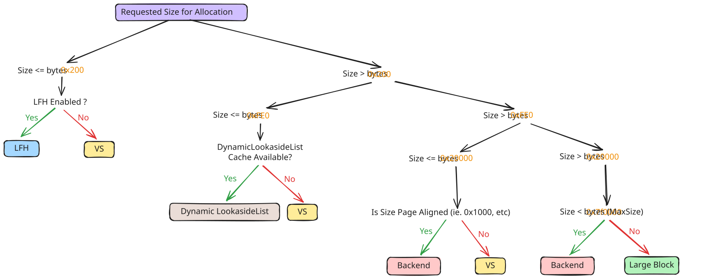
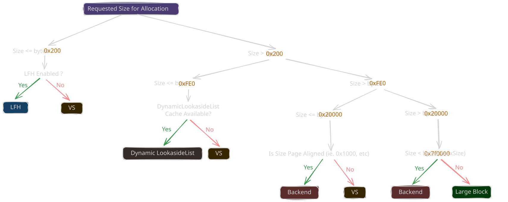

# Windows Kernel Pool

<p class="reading-meta">{{ #word_count }} words · {{ #reading_time }}</p>

The kernel pool is allocator-managed memory used by kernel components and drivers for dynamic memory allocations. Before Windows 10 19H1, kernel pool allocations used the legacy NT pool allocator. From 19H1 onward, the kernel pool allocation path uses the segment heap based allocator.

## Pool Types
Mainly two types for our usecase : 
- **Paged pool**: memory that can be paged out and is used for data that doesn't need to stay in physical RAM. It may only be touched below `DISPATCH_LEVEL`.
- **Nonpaged pool**: Memory that is never paged out and stays resident in RAM. It can be read at any IRQL. It is mostly used for data accessed by code that cannot tolerate page faults

The `PoolType` argument of `ExAllocatePoolWithTag` includes more information:

- bit 0: `Paged` vs NonPagedPool allocation
- bit 1: `MustSucceed` If the allocation fails, the kernel bugchecks instead of returning `NULL`.
- bit 2: `CacheAligned` Returns a cache-line-aligned pointer (see [Pool Header](05-pool-header.md)).
- bit 3: `PoolQuota` Charges the allocation against the requesting process’s pool quota (the amount of kernel pool memory it is allowed to consume). `ProcessBilled` identifies the process that is charged for the allocation.
- bit 9: `NonPagedPoolNx`  allocates from non-executable nonpaged pool.

Kernel code typically reaches this allocator through APIs such as:
```c
PVOID ExAllocatePoolWithTag(POOL_TYPE PoolType, SIZE_T NumberOfBytes, ULONG Tag);
```
```c
VOID ExFreePoolWithTag(PVOID P, ULONG Tag);
```

## Allocator Overview

<span class="theme-diagram diagram-lg">
  
  
</span>

The segment heap routes requests by size and allocator state. 
- **FrontEnd Allocator**
    - **LFH**: Low Fragmentation Heap allocator.
    - **VS**: Variable Size allocator.
- **Backend Allocator**
    - **Segment allocation**: backend page/block allocator.
- **Large block allocation**: separate path for very large allocations.


The NT heap path uses `RtlpAllocateHeap` / `RtlpFreeHeap`. The kernel segment heap is very similar to the userland segment heap; only some sizes and configuration differ. These notes focus on **Windows 10 20H2**.

| Size range | Allocator | Implementation |
| --- | --- | --- |
| < 512 B, LFH enabled | LFH | `RtlpHpLfhContextAllocate` |
| 512 B – 128 KiB | VS | `RtlpHpVsContextAllocateInternal` |
| 128 KiB – ~8 MiB | Backend segment | `RtlpHpSegAlloc` |
| > ~8 MiB | Large block | `RtlpHpLargeAlloc` |

If the frontend allocator does not have enough memory available, it requests memory from the backend.

<div class="admonition note">
<p class="admonition-title">Dynamic Lookaside</p>
<p>Allocations in the <code>0x201 &lt; Size &lt; 0xfe0</code> (~512 B to ~4 KB) range are served from a dynamic lookaside list first, before reaching VS. See the [Dynamic Lookaside](06-dynamic-lookaside.md) chapter.</p>
</div>
