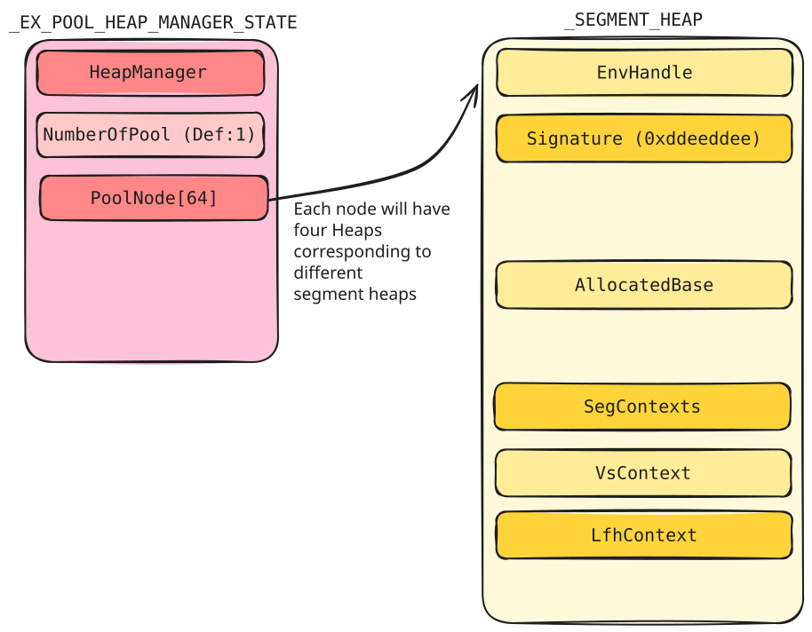
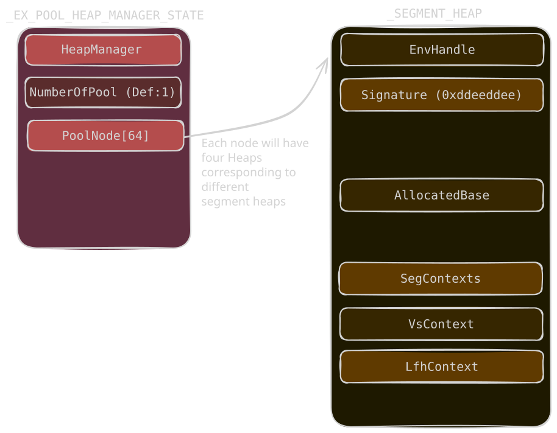

# Core Structures

<p class="reading-meta">{{ #word_count }} words · {{ #reading_time }}</p>

## Heap Manager State

`nt!ExPoolState` is the core global state for kernel pool memory allocation. It contains the heap manager and the pool nodes used to reach the actual segment heaps.

| Field | Meaning |
| --- | --- |
| `HeapManager` | `_RTLP_HP_HEAP_MANAGER`. Stores global variables and metadata for the kernel pool manager. |
| `NumberOfPool` | Number of pool nodes. Default is 1. |
| `PoolNode[64]` | Each node is an `_EX_HEAP_POOL_NODE` and holds four heaps corresponding to different segment heaps (Paged / Nonpaged pool, etc.). |

These four segment heaps are created and initialized when the system boots (`ExPoolState.PoolNode[0].Heap[0-4]`).

```text
ExPoolState.PoolNode[0].Heap[0] -> NonPagedPool
ExPoolState.PoolNode[0].Heap[1] -> NonPagedPoolNx
ExPoolState.PoolNode[0].Heap[2] -> PagedPool
ExPoolState.PoolNode[0].Heap[3] -> PagedPrototype
```

## Segment Heap

<span class="theme-diagram" width="70%">
  
  
</span>

`_SEGMENT_HEAP` is the core heap object used for a pool type. Each pool type has its own `_SEGMENT_HEAP`; when allocating, the pool type decides which heap is used.  
Some of its members are : 

| Field | Meaning |
| --- | --- |
| `EnvHandle` | `RTL_HP_ENV_HANDLE`. The environment handle of the segment heap. |
| `Signature` | Signature of the segment heap. It is **always** `0xddeeddee`. |
| `AllocatedBase` | Points to the end of the entire `_SEGMENT_HEAP` structure. Used to allocate the structures required by the LFH allocator (bucket, owner, affinity slot). After allocation it points to the end of the allocated structure. Used in LFH activation (see [LFH - Activation Mechanism](03-low-fragmentation-heap.md#activation-mechanism)). |
| `SegContexts` | Two `_HEAP_SEG_CONTEXT` structures, the core structure of the backend manager, divided by size into two contexts (`0x20000 < Size <= 0x7f000` and `0x7f000 < Size <= 0x7f0000`). We'll talk about this in [Backend Segment Allocation](07-backend-segment-allocation.md). |
| `VsContext` | `_HEAP_VS_CONTEXT`. The core structure of the frontend VS allocator. We'll talk about this in [Variable Size Allocation](04-variable-size-allocation.md). |
| `LfhContext` | `_HEAP_LFH_CONTEXT`. The core structure of the frontend LFH allocator. We'll talk about this in [Low Fragmentation Heap](03-low-fragmentation-heap.md). |

## Heap Globals

`nt!RtlpHpHeapGlobals` stores keys and global values used by segment heap internals. In the segment heap, many fields, values, and function pointers are encoded; this structure stores the keys used to decode them.

```text
_RTLP_HP_HEAP_GLOBALS
0x0    HeapKey (8 bytes)
0x8    LfhKey (8 bytes)
```

| Field | Meaning |
| --- | --- |
| `HeapKey` | Random value used by the VS allocator and the backend (segment) allocator encoding. |
| `LfhKey` | Random value used by the LFH allocator encoding. |