# Low Fragmentation Heap

{{ #word_count }} words · {{ #reading_time }}

LFH is the frontend allocator for fixed-size blocks. It groups allocations by size class and manages blocks through buckets, affinity slots, and subsegments.

## Why LFH?

A heap that serves every allocation from one contiguous free space quickly fragments: allocations and frees of many different sizes leave small, scattered gaps that are too small to satisfy larger requests, wasting memory. LFH mitigates this by grouping allocations into **buckets by size**, where every block in a bucket is the same size. A freed block is therefore immediately reusable by the next allocation of the same size, with no splitting or coalescing across sizes.

That is why it is called a *low fragmentation* heap: freed slots stay reusable instead of turning the heap into unusable fragments.

## Allocation Size

LFH applies when `Size <= 512 bytes` and LFH is enabled for that size (see [Activation Mechanism](#activation-mechanism)).

## LFH Structures

  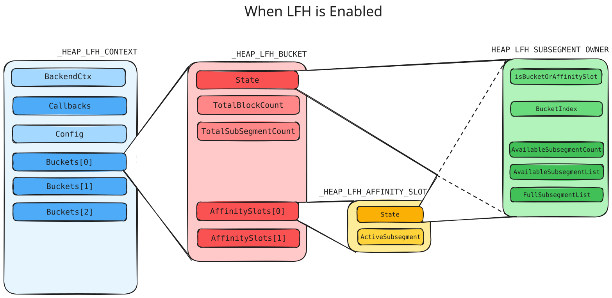
  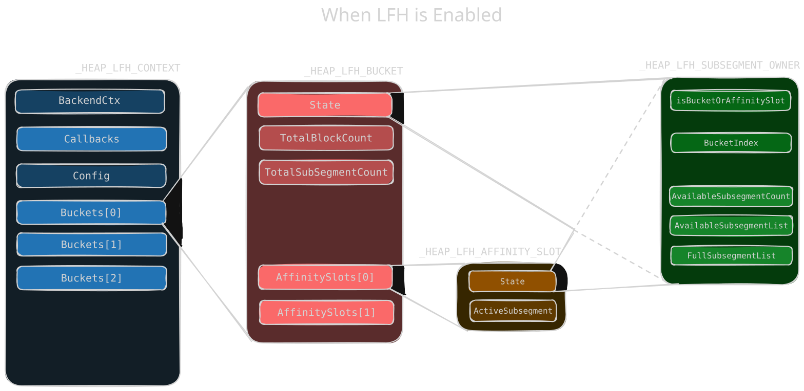

`_HEAP_LFH_CONTEXT` is the main LFH allocator state. It tracks the backend context, callback table, configuration, buckets, and related state for managing LFH blocks.

| Field | Meaning |
| --- | --- |
| `BackendCtx` | Points to the backend allocator (`_HEAP_SEG_CONTEXT`) used by LFH. |
| `Callbacks` | `_HEAP_SUBALLOCATOR_CALLBACKS`. Callback function table used to allocate / release subsegments: `Allocate`, `Free`, `Commit`, `Decommit`, `ExtendContext`. The function pointers are encoded (see below). |
| `Config` | `_RTL_HP_LFH_CONFIG`. Attributes of the LFH allocator; used to determine whether the allocation size is within the LFH scope. (see [LFH Config](#lfh-config))|
| `Buckets[129]` | Bucket array. Each bucket corresponds to blocks in a specific size range. When LFH is enabled it points to a `_HEAP_LFH_BUCKET` (see [LFH Bucket](#lfh-bucket)), otherwise the entry stores the allocation counter described in Activation. |

Encoding

<strong>EncodedCallback</strong> = <code>FunctionPointer ^ RtlpHpHeapGlobals.HeapKey ^ LfhContext</code>

### LFH Config

`_RTL_HP_LFH_CONFIG` describes the attributes of the LFH allocator:

| Field | Meaning |
| --- | --- |
| `MaxBlockSize` | The size of the max block in LFH. |
| `WitholdPageCrossingBlocks` | Whether there are any cross-page blocks. |
| `DisableRandomization` | Whether to disable randomization of LFH. |

### LFH Bucket

The bucket and its related structures are allocated only when LFH is enabled. A bucket is a `_HEAP_LFH_BUCKET`:

| Field | Meaning |
| --- | --- |
| `State` | `_HEAP_LFH_SUBSEGMENT_OWNER`. Indicates the status of the bucket; used to manage the memory pool of LFH. |
| `TotalBlockCount` | Total number of blocks in the bucket. |
| `TotalSubsegmentCount` | Total number of subsegments in the bucket. |
| `ReciprocalBlockSize` | Reciprocal of the block size (used for fast division). |
| `AffinitySlots[]` | Pointer array to `_HEAP_LFH_AFFINITY_SLOT`. The main structure used to manage the memory pool used by LFH. There is only one by default. |

### Affinity Slot

`_HEAP_LFH_AFFINITY_SLOT` is the main structure used to manage the memory pool used by LFH:

| Field | Meaning |
| --- | --- |
| `State` | Same structure as `State` in the LFH bucket, but this one is mainly used to manage subsegments. |
| `ActiveSubsegment` | `_HEAP_LFH_FAST_REF`. Points to the subsegment being used. The lowest 12 bits indicate how many blocks are available in the subsegment. |

### Subsegment Owner

`_HEAP_LFH_SUBSEGMENT_OWNER` is the state structure used both by buckets and affinity slots:

| Field | Meaning |
| --- | --- |
| `IsBuckets` | Whether this owner is the bucket (as opposed to an affinity slot). |
| `BucketIndex` | The index of the bucket. |
| `AvailableSubsegmentCount` | Number of available subsegments. |
| `AvailableSubsegmentList` | `_LIST_ENTRY`. Points to the next available subsegment in the bucket. |
| `FullSubsegmentList` | `_LIST_ENTRY`. Points to the next used-up subsegment in the bucket. |

## Subsegments

  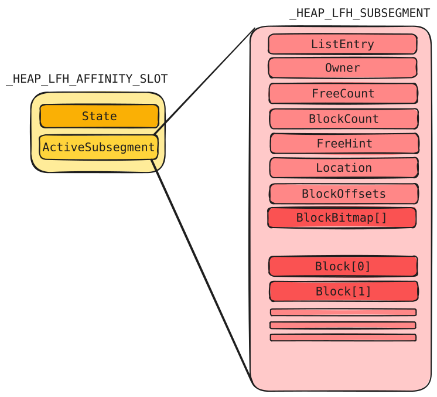
  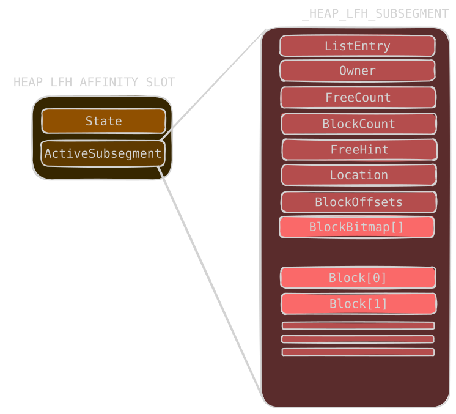

`_HEAP_LFH_SUBSEGMENT` contains the block metadata for a group of same-sized LFH blocks. When there is not enough memory, LFH first takes a subsegment from `Buckets->State.AvailableSubsegmentList` and if none is available it allocates a new subsegment from the backend allocator.

| Field | Meaning |
| --- | --- |
| `ListEntry` | `_LIST_ENTRY` (Flink/Blink). Points to the next / previous full or available LFH subsegment. |
| `Owner` | Points to the structure that manages the subsegment, back to the `AffinitySlots->State` of the bucket it belongs to. |
| `FreeCount` | Number of freed blocks currently free in the subsegment (incremented on each free; used with `BlockCount` to detect an empty subsegment). |
| `BlockCount` | Total number of blocks in this subsegment. |
| `FreeHint` | Index of the last allocated block; updated when a higher-index block is freed |
| `Location` | Indicates the subsegment's current list/state (e.g., AvailableSubsegmentList(0) or FullSubsegmentList(1)). |
| `BlockOffsets` | `HEAP_LFH_SUBSEGMENT_ENCODED_OFFSETS`. Indicates the block size of the subsegment and the offset of the first block. The value is encoded (see below). |
| `BlockBitmap` | Inline array of 64-bit words (not a pointer). Each word covers 32 blocks, 2 bits per block: bit 0 = `is_busy`, bit 1 = unused bytes. |
| `Block` | The allocated memory returned to the user. |

### Encoded Offsets

`HEAP_LFH_SUBSEGMENT_ENCODED_OFFSETS` stores the block size and the offset of the first block in the subsegment:

| Field | Meaning |
| --- | --- |
| `BlockSize` | The size of a block in the subsegment (the original size). |
| `FirstBlockOffset` | The offset of the first block. `FirstBlock = Subsegment + FirstBlockOffset`. |

Encoding:

Encoding

<strong>EncodedData</strong> = <code>RtlpHpHeapGlobals.LfhKey ^ BlockOffsets ^ (Subsegment >> 12)</code>

## Activation Mechanism

  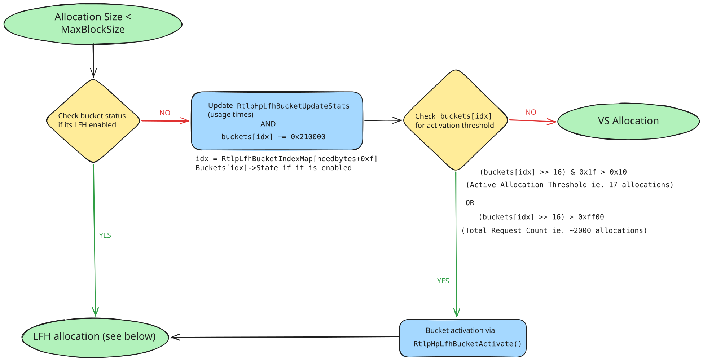
  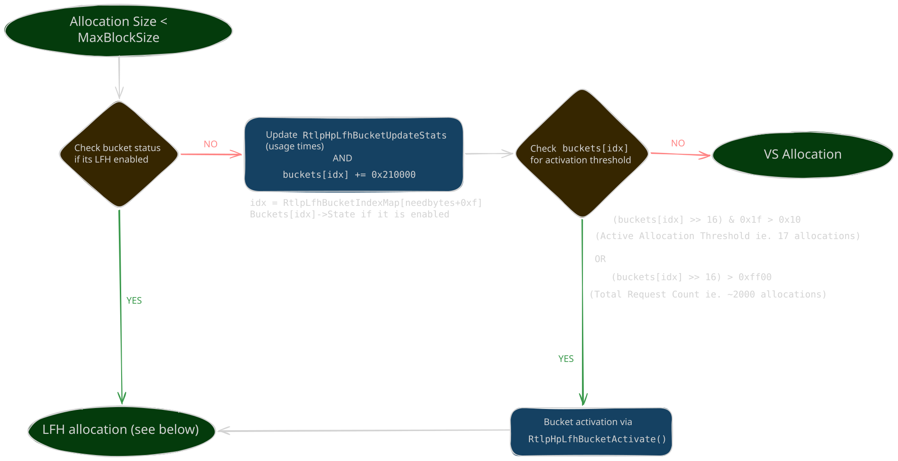

When allocating a block smaller than `LfhContext->Config.MaxBlockSize`, the allocator first checks whether LFH is enabled for the corresponding bucket:

1. Compute the bucket index: `idx = RtlpLfhBucketIndexMap[needbytes + 0xf]`.  
2. Check `Buckets[idx]->State & 1`. If set, the allocation is handled by LFH.  
3. If LFH is not enabled, update the bucket's usage statistics via `RtlpHpLfhBucketUpdateStats`. Each allocation adds `0x210000` to `buckets[idx]`.  
4. LFH is activated via `RtlpHpLfhBucketActivate` when either threshold is crossed:
   * `(buckets[idx] >> 16) & 0x1f > 0x10` : the **active-allocation counter** exceeds `0x10` (16).
   * `(buckets[idx] >> 16) > 0xff00` : the **total-request counter** exceeds `0xff00` (65,280).
   Since each allocation adds `0x210000`, the upper 16 bits increase by `0x21` (33) per allocation. Thus, `0xff00 / 0x21 ≈ 1,978`, giving the **~2,000-allocation threshold**.

When LFH is activated, the required bucket structures (bucket, owner, affinity slot, etc.) are allocated with `RtlpHpHeapExtendContext`, directly from `_SEGMENT_HEAP->AllocatedBase` (which usually points to the end of the segment heap structure), then initialized by `RtlpHpLfhBucketInitialize`. Once enabled, LFH is used for every allocation of that size.

## Allocation Mechanism

  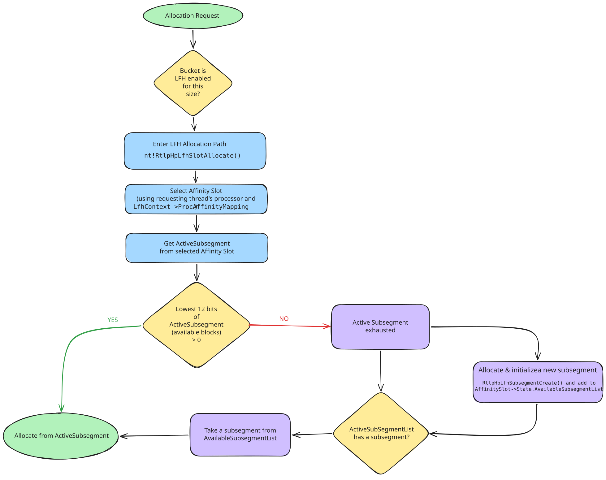
  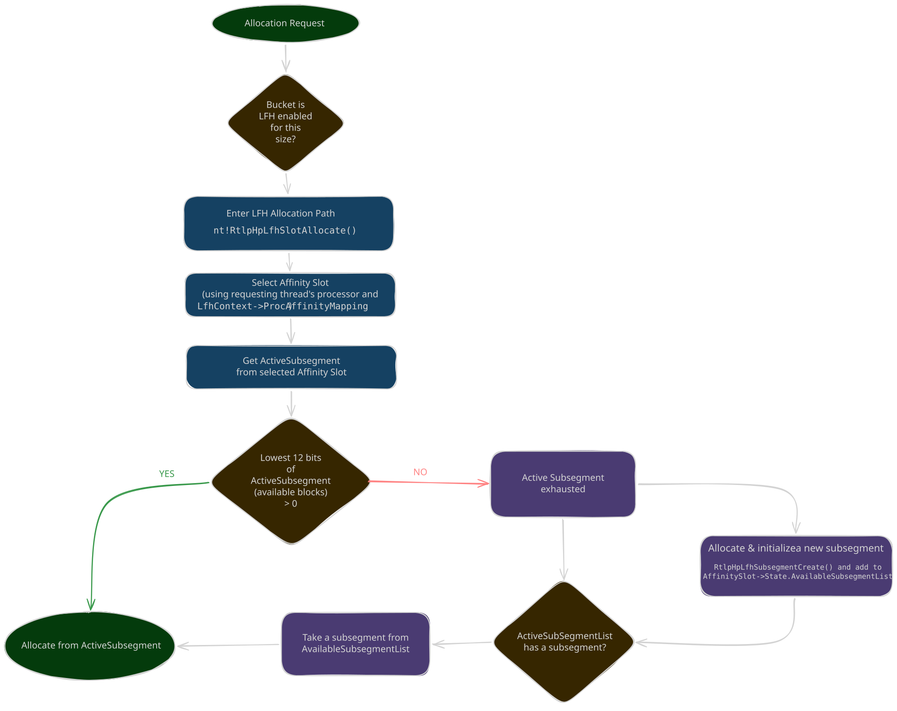

LFH allocation first finds or creates the relevant bucket for the requested size (see Activation). If LFH is enabled for the size, allocation continues in `nt!RtlpHpLfhSlotAllocate`:

1. Select an affinity slot (using the requesting thread's processor and `LfhContext->ProcAffinityMapping`).
2. Get the `ActiveSubsegment` from the selected affinity slot.
3. If the lowest 12 bits of `ActiveSubsegment` (available blocks) is greater than 0, allocate a block from the active subsegment. Otherwise, take a subsegment from `AvailableSubsegmentList`, or if none is available allocate and initialize a new subsegment with `RtlpHpLfhSubsegmentCreate` and add it to `AffinitySlot->State.AvailableSubsegmentList`.

### Allocating a Block from the Active Subsegment

  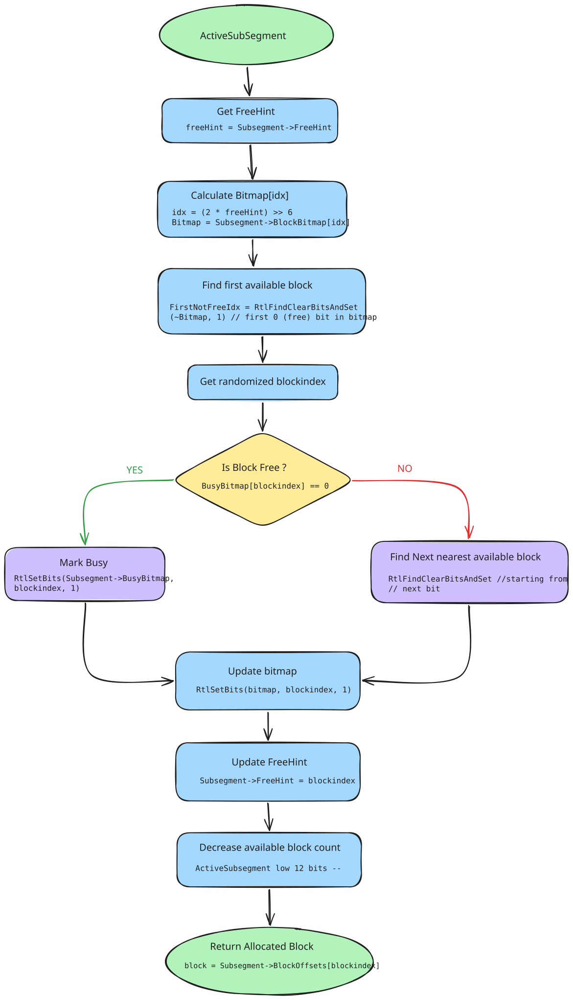
  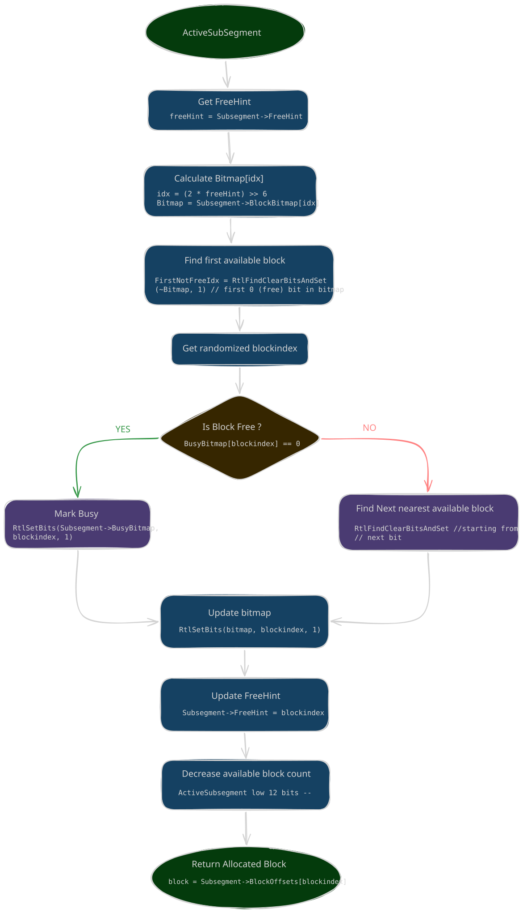

Which block is selected is randomized, similar to LFH in the NT heap:

1. **Get a random value:** Read `RtlpLowFragHeapRandomData[x]`, a 256-byte table containing values from `0x00`–`0x7f`.
2. **Locate the bitmap entry:** Use `FreeHint` to select the relevant `BlockBitmap` entry: `Index = (2 * FreeHint) >> 6`; then `Bitmap = BlockBitmap[Index]`.
3. **Find a reference point:** Locate the first **allocated/busy block** (`FirstNotFreeIdx`) in the bitmap. This is used as the starting point for randomized selection.
4. **Calculate the candidate block:**
   * `SearchWidth = RtlpSearchWidth[BucketIndex]`
   * `randval = RtlpLowFragHeapRandomData[x]`
   * `val = (SearchWidth * randval >> 7) & 0x1FFFFFE`
   * `blockIndex = (FirstNotFreeIdx + val) & 0x3f`
5. **Find a free block:** Check the candidate's busy bit. If it is busy, search for the nearest free block; if free, mark it as allocated in `BlockBitmap`.
6. **Record unused space:** If the allocation does not consume the entire block, store the unused-byte count at the end of the block.
7. **Update metadata:** Set `FreeHint = blockIndex`, decrement the available-block count (low 12 bits of `ActiveSubsegment`), and return the block.

## Free Mechanism

  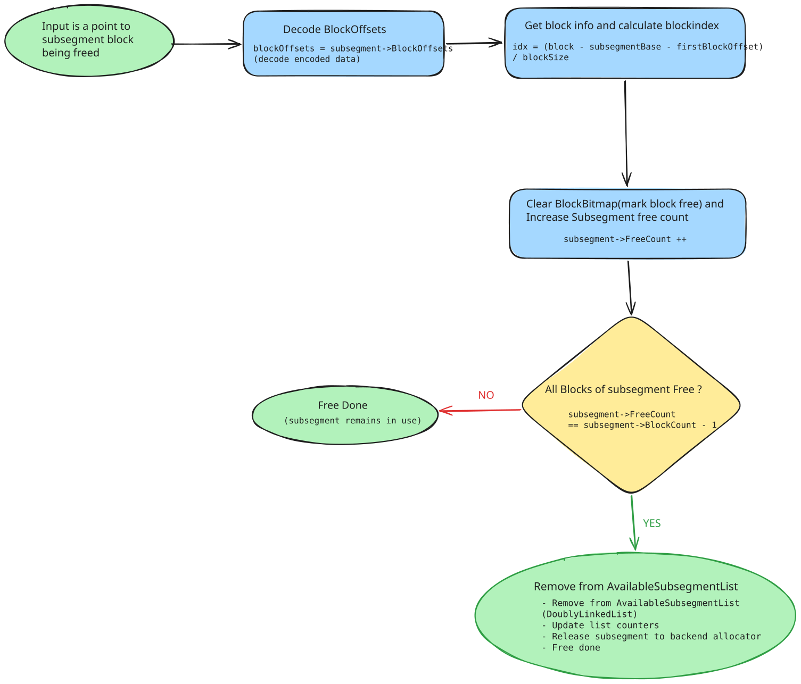
  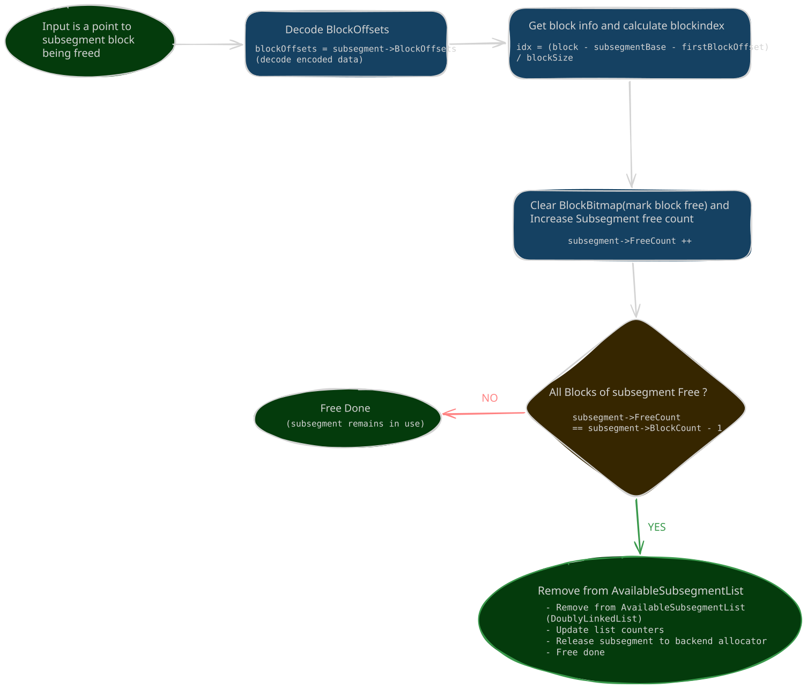

Freeing an LFH block is handled by `nt!RtlpHpLfhSubsegmentFreeBlock`:

1. Decode `Subsegment->BlockOffsets` to recover the block size and the offset of the first block.
2. Compute the block index: `idx = (block - subsegmentBase - FirstBlockOffset) / BlockSize`.
3. Clear the corresponding `BlockBitmap` bit and increment `Subsegment->FreeCount`.
4. If `FreeCount == BlockCount - 1`, all blocks of the subsegment are free: remove the subsegment from `AvailableSubsegmentList` (with a double-linked-list check) and release the subsegment back to the backend allocator.
5. Otherwise the subsegment stays in use and free is done.