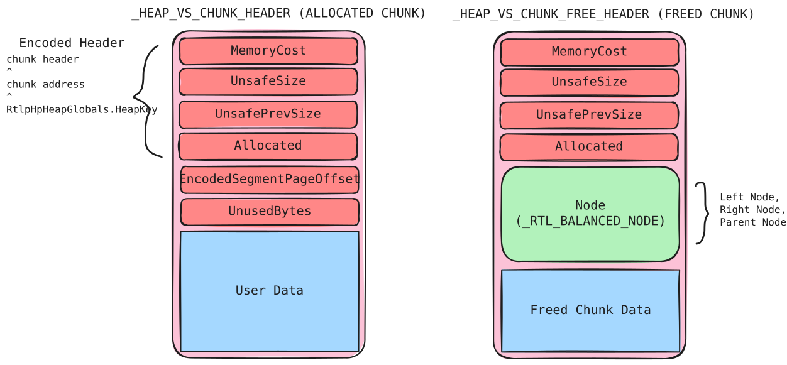
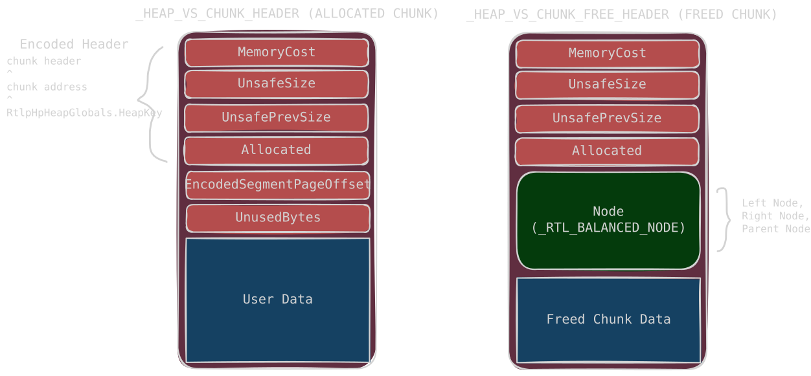
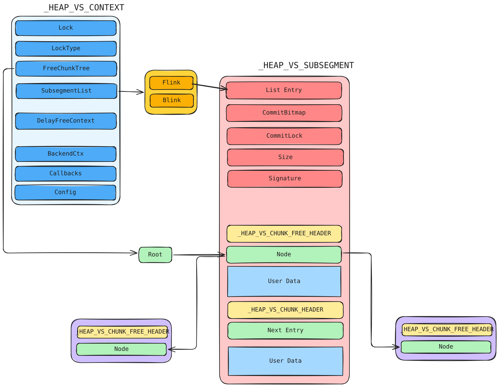
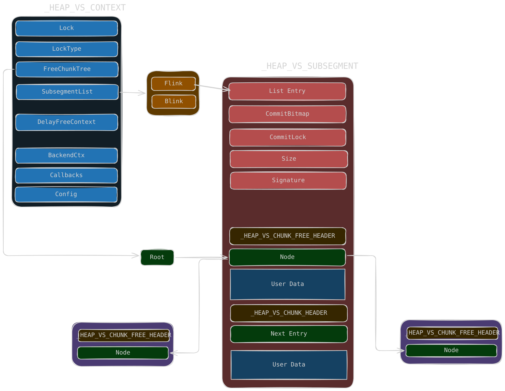
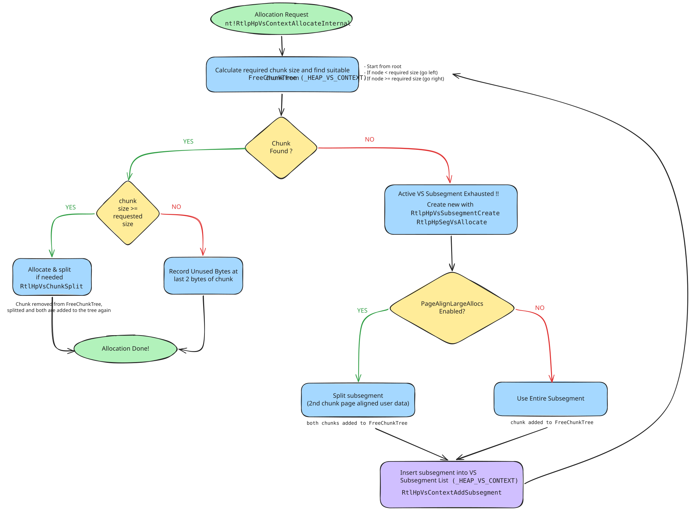
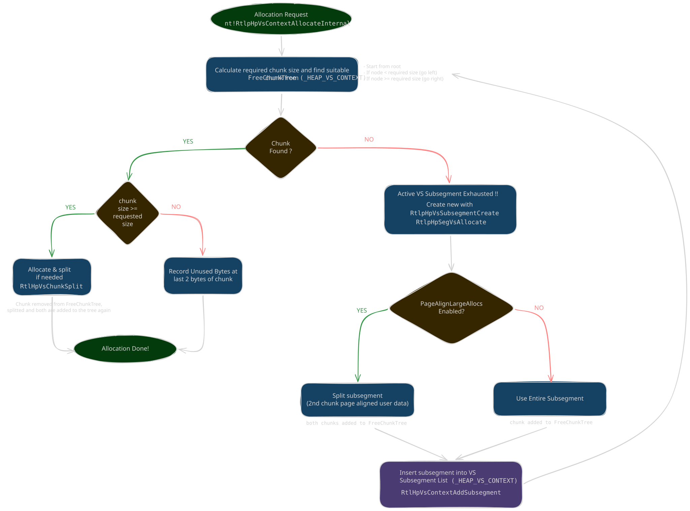
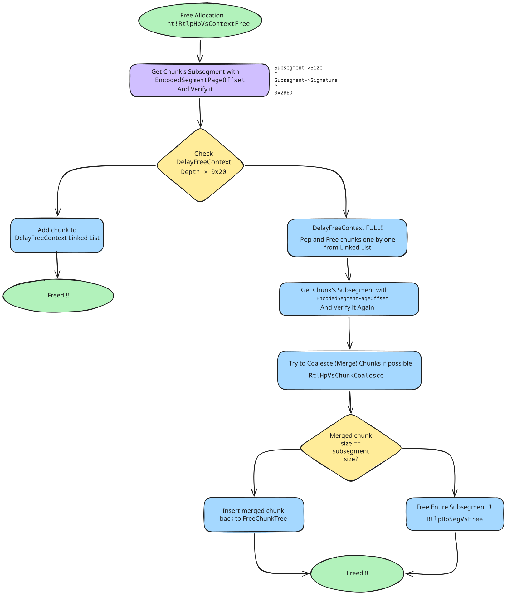
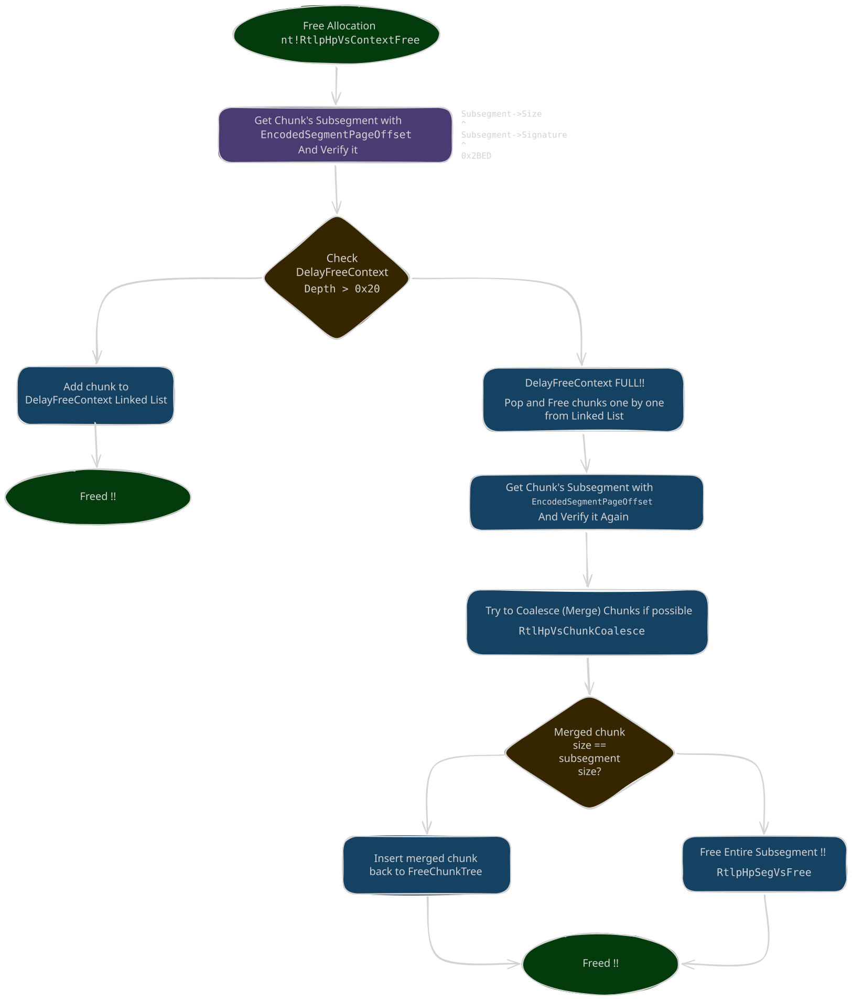

# Variable Size Allocation

<p class="reading-meta">{{ #word_count }} words · {{ #reading_time }}</p>

VS is the frontend allocator for variable-sized chunks. It is used for allocations that are too large or unsuitable for LFH but still below the backend/large-block threshold.

## Allocation Size

VS is used when:

- `Size <= 0x200` and LFH is not enabled for that size
- `0x200 < Size <= 0xfe0`
- `0xfe0 < Size <= 0x20000` and `(Size & 0xfff) != 0` (ie. size not page aligned)

## VS Chunks

<span class="theme-diagram diagram-lg">
  
  
</span>

A chunk is the basic unit of the VS allocator. In front of every chunk there is metadata that records chunk information (`_HEAP_VS_CHUNK_HEADER` for in-use chunks, `_HEAP_VS_CHUNK_FREE_HEADER` for freed chunks). This is similar to the backend allocator in the NT heap.

### In-use chunk header

| Field | Meaning |
| --- | --- |
| `MemoryCost` | Only used when freed (see free header). |
| `UnsafeSize` | The size of the chunk. |
| `UnsafePrevSize` | The size of the previous chunk. |
| `Allocated` | Indicates whether the chunk is allocated (value is 1 if allocated). |
| `EncodedSegmentPageOffset` | Index of the page of the chunk inside the VS subsegment. Used to find the VS subsegment on free. It is also encoded (see below). |
| `UnusedBytes` | Indicates whether the allocated chunk has unused memory. |

The chunk header is encoded:

<div class="admonition warn">
<p class="admonition-title">Encoding</p>
<p><strong>Encoded header</strong> = <code>Chunk Header ^ Chunk Address ^ RtlpHpHeapGlobals.HeapKey</code></p>
<p><strong>EncodedSegmentPageOffset</strong> = <code>Chunk Address ^ SegmentPageOffset ^ RtlpHpHeapGlobals.HeapKey</code></p>
</div>

### Freed chunk header

The 8-byte header is the same as the allocated chunk. Differences:

| Field | Meaning |
| --- | --- |
| `MemoryCost` | Indicates how many pages of memory need to be committed when the chunk is allocated. |
| `Node` | `_RTL_BALANCED_NODE`: `Left` (8 bytes), `Right` (8 bytes), `ParentValue` (8 bytes). The node of the red-black tree; freed chunks are stored in the `FreeChunkTree`. |

## VS Context


<span class="theme-diagram diagram-lg">
  
  
</span>

`_HEAP_VS_CONTEXT` is the main VS allocator state. It manages free chunks, delay-free state, subsegments, and configuration used by the variable-size path.

| Field | Meaning |
| --- | --- |
| `FreeChunkTree` | `_RTL_RB_TREE`. Red-black tree of free chunks, ordered by size (see [FreeChunkTree](#freechunktree)). |
| `SubsegmentList` | Linked list of VS subsegments. |
| `DelayFreeContext` | `_HEAP_VS_DELAY_FREE_CONTEXT`. State for delayed frees. (see [DelayFreeContext](#delayfreecontext)) |
| `BackendCtx` | Points to the backend allocator (`_HEAP_SEG_CONTEXT`) used by the VS allocator. |
| `Callbacks` | `_HEAP_SUBALLOCATOR_CALLBACKS`. Callback function table used to allocate / free subsegments (`Allocate`, `Free`, `Commit`, `Decommit`, `ExtendContext`). The function pointers are encoded (see below). |
| `Config` | `_RTL_HP_VS_CONFIG`. Attributes of the VS allocator. |

<div class="admonition warn">
<p class="admonition-title">Encoding</p>
<p><strong>EncodedCallback</strong> = <code>FunctionPointer ^ VsContext ^ RtlpHpHeapGlobals.HeapKey</code></p>
</div>

### VS Config

```text
_RTL_HP_VS_CONFIG
PageAlignLargeAllocs   default 1 in kernel, 0 in usermode
FullDecommit
EnableDelayFree        default 1 in kernel, 0 in usermode
```

### FreeChunkTree

After a chunk is freed, it is placed into the `FreeChunkTree` of the heap, inserted according to size. If the chunk is larger than the node it goes into the right subtree, otherwise into the left subtree. If there is no chunk larger than a node, its right subtree is NULL (and similarly for the left).

```text
_RTL_RB_TREE
0x0    Root
0x8    Encoded
```

| Field | Meaning |
| --- | --- |
| `Root` | Points to the root of the red-black tree. |
| `Encoded` | Indicates whether the root has been encoded (default disabled). |

<div class="admonition note">
<p class="admonition-title">Encoding</p>
<p><strong>EncodedRoot</strong> = <code>Root ^ FreeChunkTree</code></p>
</div>

There is a node check when a node is taken out of the tree.

### DelayFreeContext

When delay free is enabled (default enabled in the kernel, disabled in usermode) and the chunk size is `< 0x1000`, freeing a chunk does not free it immediately. The chunk is added to a singly linked list (`DelayFreeContext`); once the number of chunks in the list exceeds `0x20`, all chunks in the list are freed at once. The next pointer is stored at the beginning of the user data, and the list is FILO. To check whether delay free is enabled, inspect `VsContext->Config`.

| Field | Meaning |
| --- | --- |
| `Depth` | The number of chunks in the linked list. |
| `Sequence` | Monotonic sequence number. |
| `NextEntry` | Points to the next chunk. At this time the chunk is **still marked Allocated**. |

## VS Subsegment

`_HEAP_VS_SUBSEGMENT` is the memory pool of VS allocation. When there is not enough memory, a new subsegment is allocated from the backend allocator. Each subsegment is linked into a linked list (`VsContext->SubsegmentList`).

| Field | Meaning |
| --- | --- |
| `ListEntry` | `_LIST_ENTRY` (Flink/Blink). Points to the next / previous subsegment. The value is encoded (see below). There is also a double-linked-list check. |
| `CommitBitmap` | Indicates the commit status of pages in the subsegment; pages are counted from the beginning of the subsegment. |
| `CommitLock` | Lock used when committing pages. |
| `Size` | Size of the VS subsegment, right-shifted by 4 bits. |
| `Signature` | 15-bit signature used for verification when freeing, to make sure the correct subsegment is found. |
| `FullCommit` | Whether the whole subsegment is committed. |

<div class="admonition warn">
<p class="admonition-title">Encoding</p>
<p><strong>EncodedFlink/Blink</strong> = <code>Flink/Blink ^ &amp;ListEntry ^ &amp;(next/prev subsegment)</code></p>
</div>

Behind the VS subsegment header is the memory pool of the VS allocator. At the beginning the whole pool is a single large chunk; it is split when allocated and coalesced with neighbors when freed.

<div class="admonition danger">
<p class="admonition-title">Verification on Free</p>
<p><code>Subsegment->Size ^ Subsegment->Signature ^ 0x2BED == 0</code>, <strong>BSOD</strong> if verification fails</p>
</div>

## Allocation Mechanism


<span class="theme-diagram diagram-lg">
  
  
</span>

The main implementation function is `nt!RtlpHpVsContextAllocateInternal`:

1. Calculate the required chunk size.
2. Find a suitable chunk in `VsContext->FreeChunkTree`. Start at the root: if the required chunk is larger than the node, continue searching in the right subtree until found or NULL.
3. If no suitable chunk is found, allocate a subsegment (`RtlpHpVsSubsegmentCreate`, which requests memory from the backend with `RtlpHpSegVsAllocate`, minimum size `0x10000`), add it to the VS context (`RtlpHpVsContextAddSubsegment`), and search `FreeChunkTree` again.
   - If `PageAlignLargeAllocs` is set, the subsegment is split into two chunks: one directly behind the subsegment structure and one whose user data is page-aligned; both are added to `FreeChunkTree`.
   - Otherwise, the entire subsegment is treated as one large chunk added to `FreeChunkTree`.
4. When a chunk is found and its size is larger than requested, split it (`RtlpHpVsChunkSplit`): remove the chunk from `FreeChunkTree`, split it, and re-add the remainder as a new free chunk. If the remainder exceeds one page, split it into two pieces according to the page.
5. If `request size < chunk size`, store the unused-byte count in the chunk's last 2 bytes so the allocator can recover the chunk's actual size when it is freed.

## Free Mechanism


<span class="theme-diagram diagram-lg">
  
  
</span>

The main implementation function is `nt!RtlpHpVsContextFree`:

1. Verify the subsegment signature and the chunk's `Allocated` byte.
2. If `UnusedBytes` is set, read the unused-byte count stored in the chunk's last 2 bytes to recover the requested user size.
3. If `DelayFreeContext.Depth < 0x20`, put the chunk on the delay-free list and return.
4. If the delay-free list is full, process the queued chunks one by one, locating each VS subsegment using `EncodedSegmentPageOffset` and verifying it again.
5. Coalesce the chunk with neighboring free chunks using `RtlpHpVsChunkCoalesce`; remove the affected chunks from `FreeChunkTree` and update `PrevSize`/`Size`.
6. If `chunk + 0x20` is at the beginning of a page, split the chunk at the page boundary.
7. If the merged chunk occupies the entire subsegment, remove and release the subsegment to the backend.
8. Otherwise, calculate and encode `MemoryCost` and `SegmentPageOffset`, then insert the merged chunk into `FreeChunkTree`.

The tree-structure is verified during coalescing/removal:

```text
L->Parent->Left == L
R->Parent->Right == R
P->Left->Parent == P
P->Right->Parent == P
```