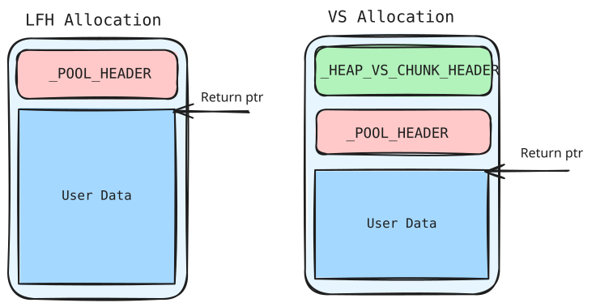
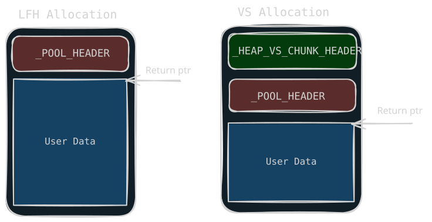
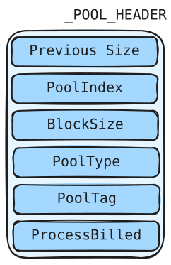
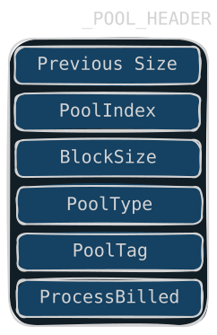
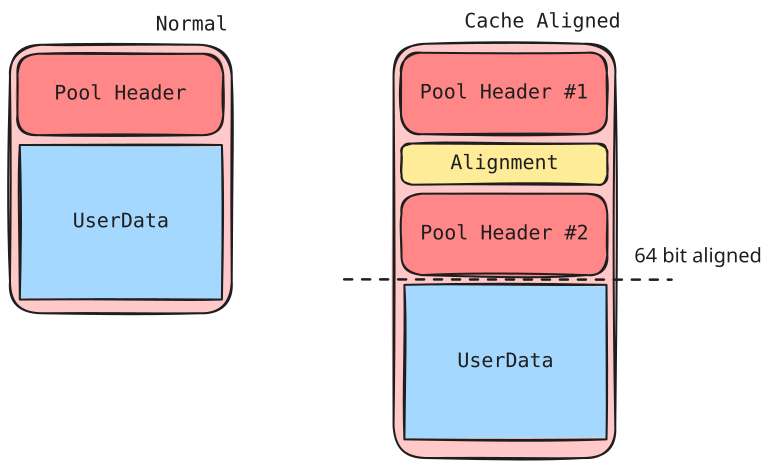
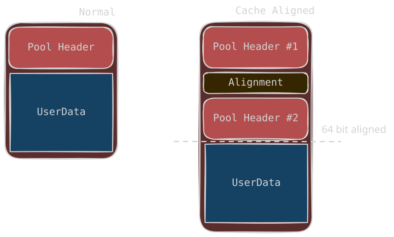

# Pool Header

<p class="reading-meta">{{ #word_count }} words · {{ #reading_time }}</p>


## Pool Header

When the allocation size is `<= 0xfe0`, both LFH and VS allocate an additional `0x10` (16) bytes to store a `_POOL_HEADER`. The pool header was mostly used by the pool allocator before 19H1. Today it is basically used in a few cases to get fields like `CacheAligned`, `PoolQuota`, and `PoolTrack`. 

The layout differs between LFH and VS:

<span class="theme-diagram" width="70%">
  
  
</span>

### Pool Header Structure

<span class="theme-diagram diagram-sm" width="20%">
  
  
</span>

| Field | Meaning |
| --- | --- |
| `PreviousSize` | Used in the `CacheAligned` case, indicating the offset between the previous pool header and this header. |
| `PoolIndex` | Useless in the segment heap. |
| `BlockSize` | The size of the block. |
| `PoolType` | The pool type of the block. |
| `PoolTag` | The tag string filled in when the block is allocated. When using `ExAllocatePoolWithTag`, you can specify the pool tag. |
| `ProcessBilled` | Used for `PoolQuota` and `CacheAligned`. |

Since 19H1 most fields are unused. The segment heap tracks sizes in its own metadata, so the allocator only sets:

```c
header->PoolTag       = PoolTag;
header->BlockSize     = BlockSize >> 4;
header->PreviousSize  = 0;
header->PoolType      = ChangedPoolType & 0x6D | 2;
```

- `PreviousSize` / `PoolIndex`: unused (kept 0). `PreviousSize` is only written in the `CacheAligned` case.
- `BlockSize`: only the free path reads it, to pick the Dynamic Lookaside bucket (see [Dynamic Lookaside](06-dynamic-lookaside.md)).
- `ProcessBilled`: only with the `PoolQuota` bit. Quota attacks from the pre-19H1 era (overwriting the pointer to get an arbitrary dereference on free) are mitigated by `ExpPoolQuotaCookie`, generated at boot:

<div class="admonition note">
<p class="admonition-title">Encoding</p>
<p><strong>ProcessBilled</strong> = <code>KPROCESS ^ ExpPoolQuotaCookie ^ chunk address</code></p>
</div>

On free the kernel decodes and validates the pointer (kernel-mode address, valid process header), so a blind overwrite bugchecks. The upside for attackers: with most fields unused, a forged header needs far less care than before 19H1.

### CacheAligned

Passing `CacheAligned` in the pool type aligns the returned pointer to the CPU cache line (64 bytes). To keep a valid header, the chunk can hold two `_POOL_HEADER`s with padding in between:

<span class="theme-diagram" width="70%">
  
  
</span>

The `PreviousSize` of the second header points back to `HEADER #1`, the real chunk header (offset between the two headers). The second header gets: `PreviousSize` = offset to header #1, `BlockSize` = reduced size, `PoolType` with the `CacheAligned` bit set, and the same `PoolTag`. The allocator first reserves room for the padding:

```c
if (PoolType & 4) {                            // CacheAligned bit set
    request_alloc_size += ExpCacheLineSize;    // +64 bytes for padding
    if (request_alloc_size > 0xFE0) {          // would exceed ~4 KB
        request_alloc_size -= ExpCacheLineSize; // undo the growth
        PoolType = PoolType & 0xFB;             // clear CacheAligned -> ignore it
    }
}
```

If the padding would push the request past `0xfe0` (~4 KB), the flag is cleared and the allocation proceeds normally.

If the alignment padding leaves room, a pointer (often called `AlignedPoolHeader`) is stored right after header #1: it points to the second header, XORed with `ExpPoolQuotaCookie`. Pre-19H1 the free path validated it; the segment-heap free path no longer does (see [Aligned Chunk Confusion](11-aligned-chunk-confusion.md)).
