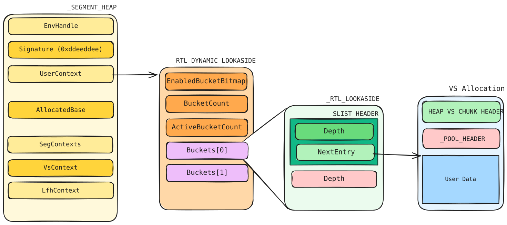
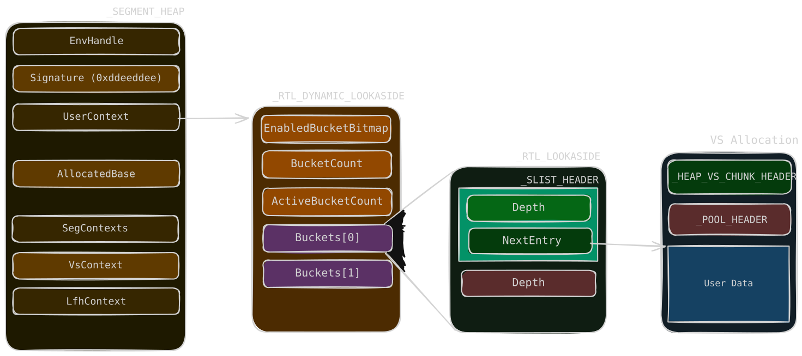

# Dynamic Lookaside

{{ #word_count }} words · {{ #reading_time }}

For allocations where `0x201 < Size < 0xfe0`, the block is not freed immediately. After free it is added to a Dynamic Lookaside list. Depending on the block size (taken from the pool header), it is added to different linked lists. On allocation, the block is taken from the dynamic lookaside first; if not found, the normal allocation path (VS) is entered.

  
  

The dynamic lookaside is stored in `_SEGMENT_HEAP->UserContext`, which is a `_RTL_DYNAMIC_LOOKASIDE`:

| Field | Meaning |
| --- | --- |
| `EnabledBucketBitmap` | A bitmap indicating which buckets have lookaside enabled. |
| `BucketCount` | The total number of buckets in the lookaside. |
| `ActiveBucketCount` | The number of buckets with lookaside enabled. |
| `Buckets[64]` | `_RTL_LOOKASIDE`. Manages the structures of different lookaside sizes. |

Each bucket is a `_RTL_LOOKASIDE`:

| Field | Meaning |
| --- | --- |
| `ListHead` | `_SLIST_HEADER`. Head of a singly linked list; contains the length of the list and the list itself (common in the Windows kernel). |
| `Depth` | The number of chunks that can be stored in the bucket. |

`_SLIST_HEADER` fields:

| Field | Meaning |
| --- | --- |
| `Depth` | The number of nodes in the linked list. |
| `NextEntry` | Points to the next node. In the dynamic lookaside, it points to the user data of the freed chunk, behind the pool header (which sits after the VS chunk header). |

Only a subset of buckets is enabled at a time (`ActiveBucketCount`). Every third scan, the Balance Set Manager rebalances: the most-used lookasides since the last rebalance are enabled, and each `Depth` is tuned by the miss ratio (grown by `MissRatio * (MaximumDepth - Depth) / 2 + 5`, shrunk when allocations are rare). Practically: spray and free a few thousand chunks of a size, wait a couple of seconds, and the matching lookaside is enabled with room in it.

A chunk sitting in a lookaside bypasses its backend free path entirely: no VS coalescing, no LFH bitmap update. It is a fast-path reuse cache, which is exactly why forged `BlockSize` values are interesting on free (see [Aligned Chunk Confusion](11-aligned-chunk-confusion.md)).
