# Backend Segment Allocation

<p class="reading-meta">{{ #word_count }} words · {{ #reading_time }}</p>

Backend segment allocation manages page-backed memory ranges. Frontend allocators request memory from this layer when they need more backing storage.

## Size

In the kernel, segment allocation applies when:

- `Size` is a multiple of a page and `Size <= 0x7f0000`
- `Size` is not a multiple of a page and `0x20000 < Size <= 0x7f0000`

It is a bit different in userland. There are two categories, differing by block unit:

```text
0x20000 < Size <= 0x7f000
  unit: 0x1000   (1 page)

0x7f000 < Size <= 0x7f0000
  unit: 0x10000  (16 pages)
```

Both units are called "page" here. A block (chunk) consists of single or multiple pages. For example, allocating `0x1450` bytes allocates 2 pages of `0x1000`, and `0x1337` allocates `0x2000` (2 page units), with the extra `0x2000 - 0x1337` recorded in the unused bytes.

## Page Segments and Ranges

### Page Segment

`_HEAP_PAGE_SEGMENT` is the memory pool of segment allocation. When no page segment is available, a new one is allocated from the system (`MmAllocatePoolMemory`), but only the required structure is allocated at the beginning (the block part is not allocated until needed). Each page segment is inserted into a double linked list.

<span class="theme-diagram" style="--diagram-width: 45%">
  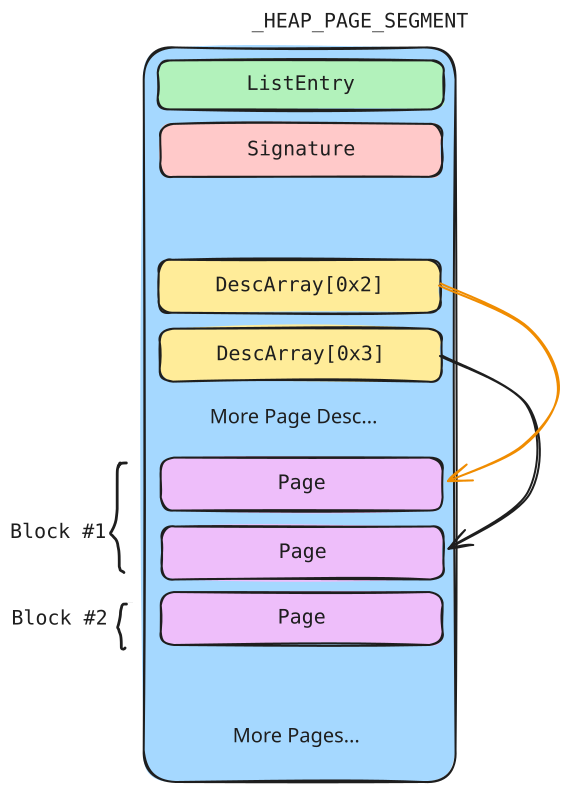
  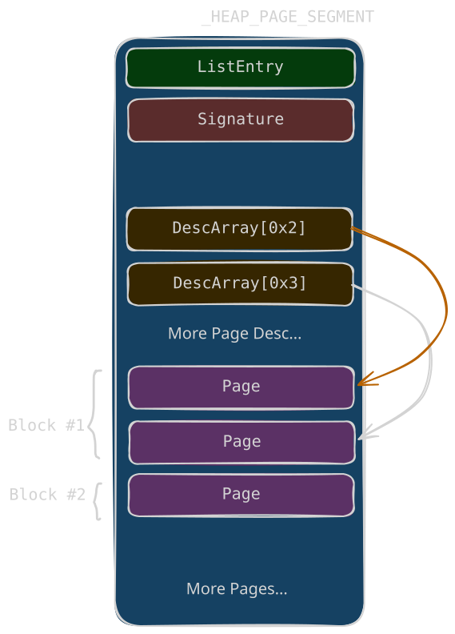
</span>

| Field | Meaning |
| --- | --- |
| `ListEntry` | `_LIST_ENTRY` (Flink/Blink). Points to the next / previous page segment in the linked list. |
| `Signature` | Signature of the page segment used to verify the page segment (encoded, see below). |
| `DescArray[256]` | Page range descriptor array. Each element corresponds to one page one-to-one. |
| `Pages` | The memory pool of the segment allocator (starts at `0x2000`). |

<div class="admonition warn">
<p class="admonition-title">Signature</p>
<p><strong>Signature</strong> = <code>Segment ^ SegContext ^ RtlpHpHeapGlobals ^ 0xA2E64EADA2E64EAD</code></p>
</div>

### Page Range Descriptor

`_HEAP_PAGE_RANGE_DESCRIPTOR` is the descriptor for a page. It indicates the status (Allocated or Freed) and information of each page in the page segment, such as whether the page is the beginning of a block or the size of the block. It can be in an allocated or freed state; freed descriptors are stored in `FreePageRanges`, an rbtree.

**Allocated (block header):**

| Field | Meaning |
| --- | --- |
| `TreeSignature` | Signature of the page range descriptor. The value is always `0xccddccdd`. Only present at the beginning of a block. |
| `UnusedBytes` | Unused bytes in an allocated block. |
| `RangeFlag` | Indicates the page status (see below). |
| `CommittedPageCount` | Number of pages committed in the corresponding block. |
| `Key` | `_HEAP_DESCRIPTOR_KEY`. Stores the size of the page corresponding to the descriptor and the number of committed pages. |

<span class="theme-diagram" width="65%">
  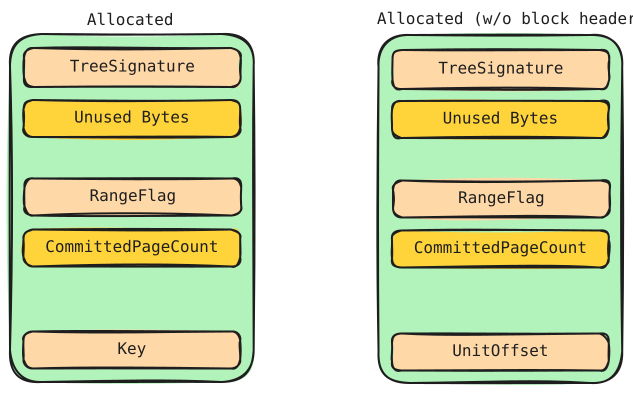
  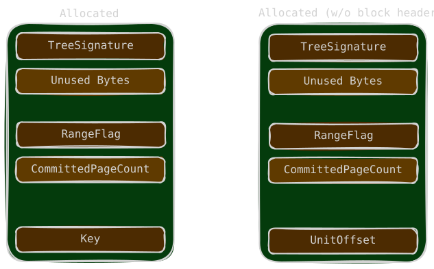
</span>

**Allocated (not header):** If the page is not the block header, `TreeSignature` is not meaningful for the block and the `Key` field's `UnitCount` is interpreted as `UnitOffset`, the offset of the page within the block (used to walk back to the header page).

**Freed:**

<span class="theme-diagram" width="65%">
  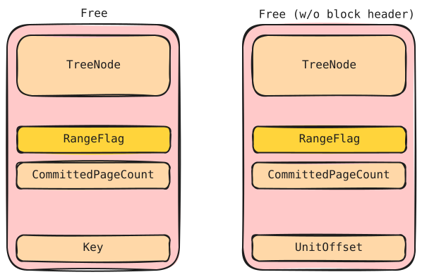
  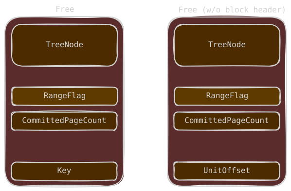
</span>

The freed descriptor is a node of the `FreePageRanges` rbtree: `Left` points to a descriptor whose block size is smaller, `Right` to a descriptor whose block size is greater, and `ParentValue` points to the parent node (the lowest 1 bit determines whether the parent is encoded). The `Key` is the same as in the allocated case.

### Range Flags

`RangeFlags` indicate page state.

Important bits from the notes:

- bit 1: allocated
- bit 2: block header
- bit 3: committed

Allocator interpretation:

<div class="admonition note">
<p class="admonition-title">Allocator</p>
<ul>
<li><strong>LFH</strong>: <code>RangeFlags &amp; 0xc = 8</code></li>
<li><strong>VS</strong>: <code>RangeFlags &amp; 0xc = 0xc</code></li>
</ul>
</div>

### Descriptor Key

```text
_HEAP_DESCRIPTOR_KEY
0x0    EncodedCommittedPageCount (2 bytes)
0x2    LargePageCost (1 byte)
0x3    UnitCount (1 byte)
```

| Field | Meaning |
| --- | --- |
| `EncodedCommittedPageCount` | The number of pages committed in the block, stored encoded (see below). Only used in the block header. |
| `LargePageCost` | Cost of a large page. |
| `UnitCount` | The size of the block, in page count. |

<div class="admonition note">
<p class="admonition-title">Encoding</p>
<p><strong>CommittedPageCount</strong> = <code>~EncodedCommittedPageCount</code></p>
</div>

<span class="theme-diagram" width="65%">
  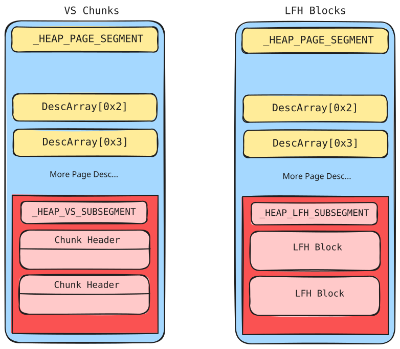
  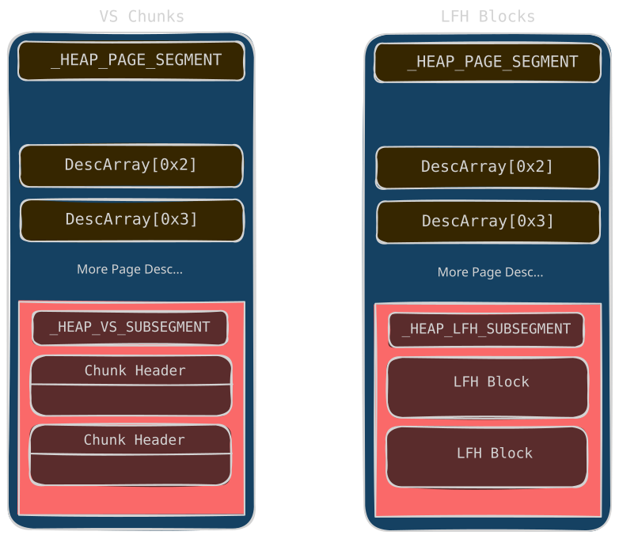
</span>

## SegContext

`_HEAP_SEG_CONTEXT` is the core structure of the segment allocation. There are two SegContexts in each heap (`Size <= 0x7f000` and `0x7f000 < Size < 0x7f0000`).

<span class="theme-diagram" width="75%">
  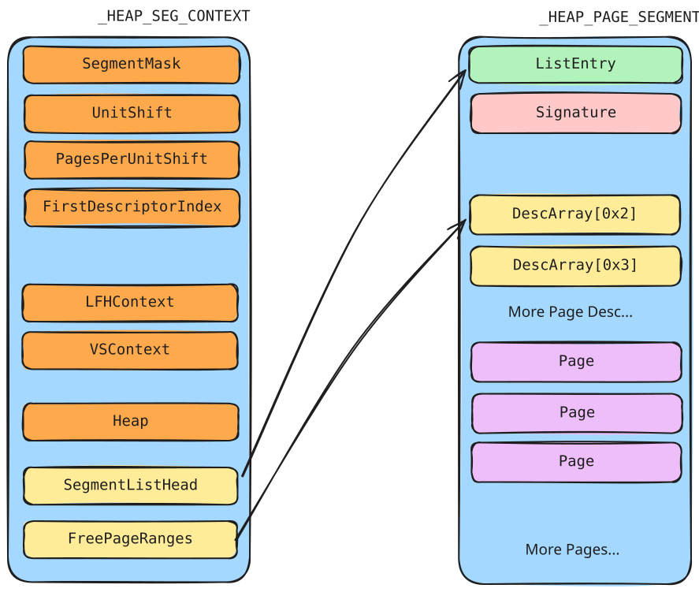
  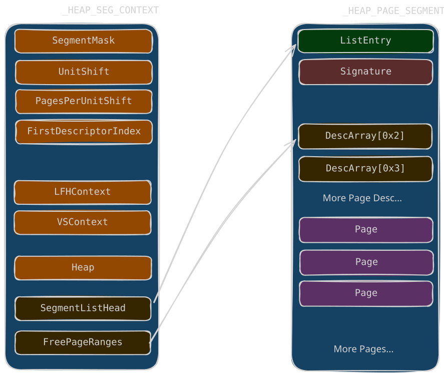
</span>

| Field | Meaning |
| --- | --- |
| `SegmentMask` | A mask used to find the page segment: `Page segment = block ptr & SegmentMask`. Valued `0xfffffffffff00000` for the 1 MB segment context. |
| `UnitShift` | Used to calculate the index of the page descriptor: `Index = block ptr >> UnitShift`. |
| `PagesPerUnitShift` | `(1 << PagesPerUnitShift)` indicates the size of a page unit in the SegContext: `(1 << PagesPerUnitShift) * 0x1000`. If the value is zero, the page unit is `0x1000`. |
| `FirstDescriptorIndex` | The index of the first page descriptor in the SegContext. |
| `LfhContext` | Points to the LFH allocator in the segment heap. |
| `VsContext` | Points to the VS allocator in the segment heap. |
| `Heap` | Points to the `_SEGMENT_HEAP` it belongs to. |
| `SegmentListHead` | `_LIST_ENTRY`. Points to the page segments in the segment allocator. It is a double linked list with an integrity check. |
| `FreePageRanges` | `_RTL_RB_TREE`. Red-black tree of free page ranges (see below). |

Example values for the `0x1000`-unit SegContext:

```text
SegmentMask (0xfffffffffff00000)  Segment = ptr & SegmentMask
UnitShift (0xc)                   Index = ptr >> 0xc (page index)
PagesPerUnitShift (0x0)           page unit = 0x1000
FirstDescriptorIndex (0x2)
```

### FreePageRanges

After releasing a block, its page descriptor is inserted into the `FreePageRanges` of the SegContext according to size: if the block size is greater than the node it goes into the right subtree, otherwise into the left subtree. If nothing is greater, the right subtree is NULL (and similarly for the left). There is a node check when a node is taken out of the tree.

```text
FreePageRanges (_RTL_RB_TREE)
0x0    Root
0x8    Encoded
```

| Field | Meaning |
| --- | --- |
| `Root` | Points to the root of the rbtree. |
| `Encoded` | Indicates whether the root has been encoded (default disabled). |

<div class="admonition note">
<p class="admonition-title">Encoding</p>
<p><strong>EncodedRoot</strong> = <code>Root ^ FreePageRanges</code></p>
</div>

## Allocation Mechanism


<span class="theme-diagram" width="60%">
  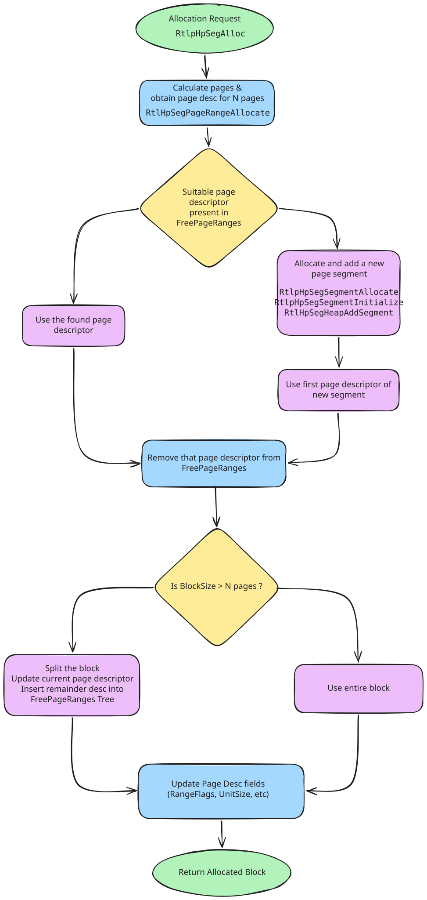
  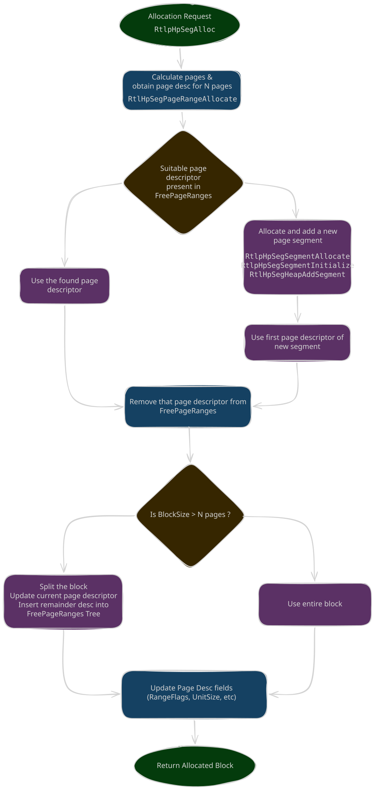
</span>

The main implementation function is `nt!RtlpHpSegAlloc`, using `RtlpHpSegPageRangeAllocate` to obtain a freed page descriptor or create a new one:

1. Search `FreePageRanges`, starting from the root; when the required block is larger than the node, continue in the right subtree until found or NULL.
2. If no suitable page descriptor is found, allocate a new page segment (`RtlpHpSegSegmentAllocate`), initialize its first page descriptor (`RtlpHpSegSegmentInitialize`), and insert it into `SegmentListHead` (`RtlpHpSegHeapAddSegment`). In fact only the memory required for the page segment and descriptor structures is allocated; the block part is not allocated at first.
3. When a page descriptor is found or created, remove it from `FreePageRanges`.
4. If the required number of pages is smaller than the block, split the block: update the current page descriptor (UnitSize), set the remaining page descriptors (RangeFlag cleared, `CommittedPageCount`, `UnitOffset`), and insert the remainder descriptor into `FreePageRanges`.
5. Update the page descriptor fields (`RangeFlags`, `UnitSize`, etc.). For example, allocating `0x1337` as 2 pages marks the header descriptor with `RangeFlags = 0x3` (First | Allocated) and `UnitSize = 0x2`, and the second page with `RangeFlags = 0x1` (Allocated) and `UnitOffset = 0x1`.
6. Check whether all pages in the block are committed: sum the `CommittedPageCount` of all descriptors in the block; if the block needs committing, commit memory to the specified VA (`RtlpHpSegMgrCommit -> RtlpHpAllocVA -> MmAllocatePoolMemory`), then update `CommittedPageCount` of all descriptors in the block.
7. Return the block:

```text
Block = (Page descriptor & SegmentMask) + ((index of page descriptor) << SegContext->UnitShift)
```

## Free Mechanism


<span class="theme-diagram" width="60%">
  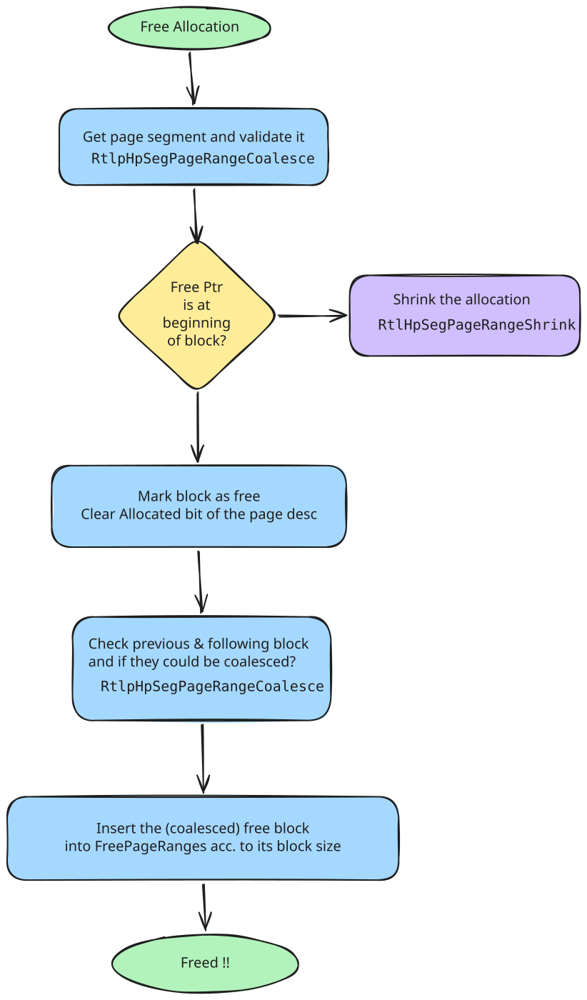
  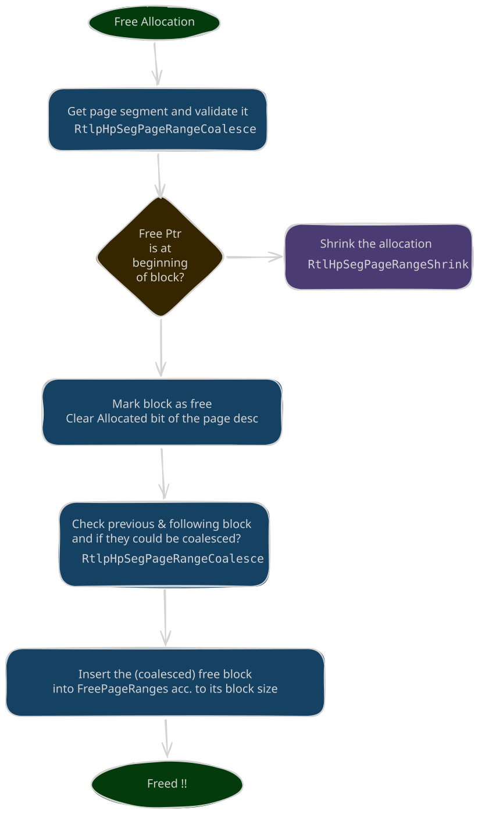
</span>

1. Verify that the page segment containing the pointer is legal (`RtlpHpSegDescriptorValidate`):
   - Signature check: **`0xA2E64EADA2E64EAD == PageSegment ^ SegContext ^ RtlpHpHeapGlobals ^ Signature`**.
   - Verify the page descriptor of the page is Allocated (double-free check).
2. Recover the structures from the free pointer:
   - **Page segment** = `free pointer & SegmentMask`
   - **Page descriptor** = `page_segment + 0x20 * ((free pointer - page segment) >> SegContext->UnitShift)`
   - **_HEAP_SEG_CONTEXT** = `page_segment ^ page_segment->Signature ^ 0xA2E64EADA2E64EAD ^ RtlpHpHeapGlobals.HeapKey`
3. Check whether the free pointer is at the beginning of a block. If it is not, check the `RangeFlag` of the page descriptor to decide whether to use the VS allocator or LFH allocator to release the memory; if the free pointer is managed directly by segment allocation, use `RtlpHpSegPageRangeShrink`.
4. Clear the Allocated bit of the page descriptor for the block, then check whether the previous and following blocks are freed; if freed, merge them (`RtlpHpSegPageRangeCoalesce`):
   - To find the previous block, check whether the descriptor of the previous page is the beginning of a block; if not, use the `UnitOffset` of the previous page's descriptor to compute the descriptor of the previous block.
   - The following block is computed using the `UnitCount` of the current page descriptor.
   - Determine whether the descriptor at the beginning of the block has the Allocated bit set.
5. If the previous block is free: remove its descriptor from `FreePageRanges`, clear the first bit of the RangeFlag of the descriptor being freed, update the `UnitCount` of the previous block's descriptor, and update the `UnitOffset` of the last page descriptor after the merge.
6. If the following block is free: remove its descriptor from `FreePageRanges`, clear the first bit of its RangeFlag, update the `UnitCount` of the descriptor being freed, and update the `UnitOffset` of the last page descriptor after the merge.
7. Finally, insert the (coalesced) free block into `FreePageRanges` according to its block size.