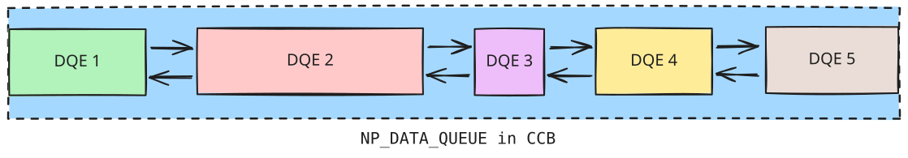
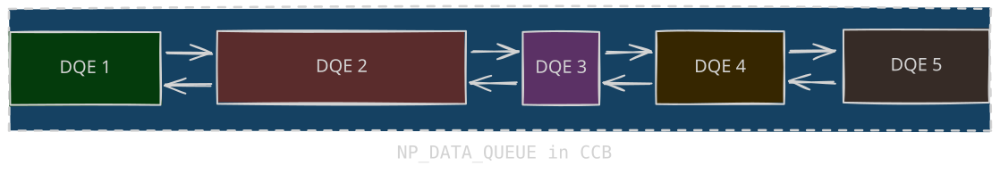
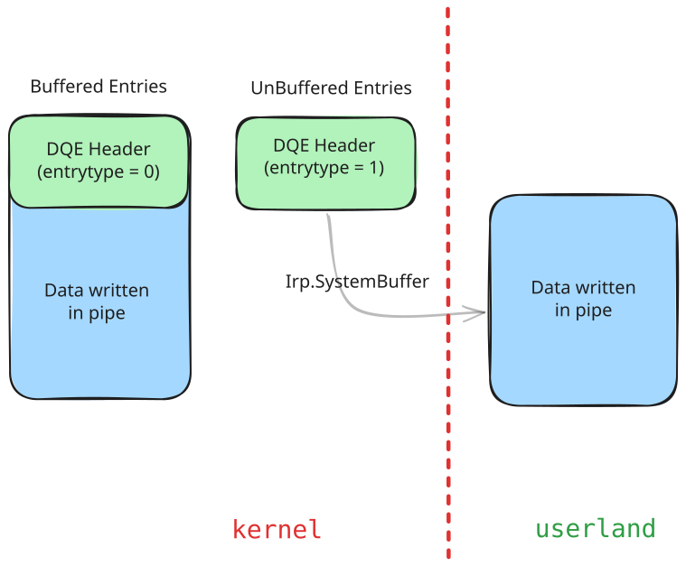
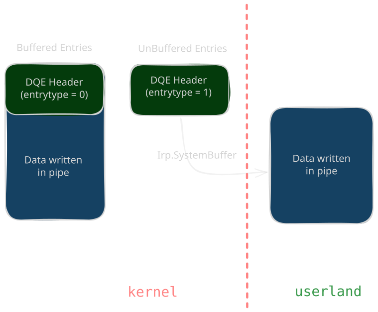

# Exploitation Techniques

<p class="reading-meta">{{ #word_count }} words · {{ #reading_time }}</p>

The techniques in this chapter turn a kernel pool overflow into privilege escalation. 

## What an Overflow Controls

To revise, a pool overflow overwrites whatever sits right after the vulnerable chunk which depends on the backend:

| Backend | Layout after the chunk |
| --- | --- |
| LFH | `_POOL_HEADER` (0x10) |
| VS | `_HEAP_VS_CHUNK_HEADER` (0x10) **+**  `_POOL_HEADER` (0x10) |

## Heap Grooming

Every technique needs the vulnerable chunk next to a chosen victim, with control over when both are allocated and freed.

For LFH sizes, spray 32 or more allocations of the exact same size before and after the victim. The allocator picks a block randomly within a 32-block bitmap window, and enough spray defeats that.

For VS sizes, allocate thousands of same-size chunks to drain `FreeChunkTree` until a fresh `0x10000` subsegment appears, then fill it so allocations end up contiguous. Free at most a third of them.

To pre-enable a Dynamic Lookaside for a size, allocate a few thousand chunks, wait about two seconds for the Balance Set Manager to rebalance, then allocate and wait again. Freed chunks of that size then land in the lookaside instead of going through the backend free path.

## Named Pipes

Both techniques rely on the Named Pipe File System (**NPFS**, implemented by `Npfs.sys`). Named pipes are an inter-process communication mechanism with two ends: the **server** (which creates the pipe) and the **client** (which connects to it). When a connection is established, NPFS creates two queues in the connection's Context Control Block: an input queue (client to server) and an output queue (server to client).

### Context Control Block

The Context Control Block(CCB) is the "connection object". It holds all state for one pipe instance: the two queues of pending reads/writes, the pipe configuration (mode, type, quota), etc. 
```c
typedef struct _NP_CCB {
    NODE_TYPE_CODE NodeType;
    UCHAR NamedPipeState;
    UCHAR ReadMode[2];
    UCHAR CompletionMode[2];
    SECURITY_QUALITY_OF_SERVICE ClientQos;
    LIST_ENTRY CcbEntry;
    PNP_FCB Fcb;
    PFILE_OBJECT FileObject[2];   // [0] = Server, [1] = Client
    PEPROCESS Process;
    PVOID ClientSession;
    PNP_NONPAGED_CCB NonPagedCcb;
    NP_DATA_QUEUE DataQueue[2];   // [0] = Input, [1] = Output
    PSECURITY_CLIENT_CONTEXT ClientContext;
    LIST_ENTRY IrpList;
} NP_CCB, *PNP_CCB;
```

### Data Queue Entries

<span class="theme-diagram" width="90%">
  
  
</span>

Each queue holds `NP_DATA_QUEUE_ENTRY` structures in non-paged pool. Entries are removed from the list when all of their data are read by a client (e.g. using the ReadFile API).

```c
struct DATA_QUEUE_ENTRY {
    LIST_ENTRY NextEntry;
    _IRP* Irp;
    _SECURITY_CLIENT_CONTEXT* SecurityContext;
    uint32_t EntryType;
    uint32_t QuotaInEntry;
    uint32_t DataSize;
    uint32_t x;
    char Data[];
};
```

| Field | Meaning |
| --- | --- |
| `NextEntry` | `LIST_ENTRY`. Doubly-linked list node connecting all queued data entries. The list includes a sentinel node stored in the CCB. |
| `Irp` | The IRP associated with the entry. Populated for unbuffered entries, or for buffered entries whose size exceeds the available pipe quota (the stalled write). |
| `SecurityContext` | The client security context captured when the entry was written. |
| `EntryType` | `0` = buffered, `1` = unbuffered. |
| `QuotaInEntry` | Quota charged to the entry. `0` for unbuffered entries. |
| `DataSize` | Length of user data associated with the entry. |
| `x` | Uninitialized, likely padding. |

### Buffered vs Unbuffered Entries

<span class="theme-diagram" width="70%">
  
  
</span>

- **Buffered DQE**
  - Created by `WriteFile`.
  - The data is copied from user space into a kernel buffer (`NP_DATA_QUEUE_ENTRY`) immediately.
  - Quota: consumes quota based on `DataSize`. If the pipe quota is full, the write stalls in `PIPE_WAIT` mode and the entry keeps its IRP until the write completes. As data is read from existing buffered entries, the freed quota is credited to the stalled write's `QuotaInEntry` until it reaches `DataSize`.
- **Unbuffered DQE**
  - Created by `NtFsControlFile` with `FSCTL_PIPE_INTERNAL_WRITE` (`0x119FF8`).
  - The data stays in user space! only a pointer to it is stored in the kernel entry (through the IRP's `SystemBuffer`).
  - Quota: consumes `0` because the data is not in the pipe's memory.

Unbuffered entries provide direct control over a chunk's size and contents. Since there is no `DATA_QUEUE_ENTRY` header stored in the chunk, the entire chunk can be used to place a fake structure.

### Pipe Attributes

After a pipe is created, attributes can be attached to it which are key-value pairs stored in a linked list. Each attribute is a `PipeAttribute` object, allocated in the PagedPool:

```c
struct PipeAttribute {
    LIST_ENTRY list;
    char* AttributeName;
    uint64_t AttributeValueSize;
    char* AttributeValue;
    char data[0];
};
```

- The allocation size and the data could be controlled by us
- `AttributeName` and `AttributeValue` point into the `data` field. 
- Attributes are created with `NtFsControlFile` using control code `0x11003C`, and an attribute's value is read back with `0x110038`, which follows the `AttributeValue` pointer and returns `AttributeValueSize` bytes. 
- Changing an attribute's value frees the old `PipeAttribute` and allocates a new one.

If the `AttributeValue` (pointer to attribute) and `AttributeValueSize` fields can be overwritten, we can then leak kernel memory, giving us an arbitrary read. And since size and data are fully controlled, the object is also a convenient way to plant controlled data in the PagedPool, for example to reallocate a freed chunk.
