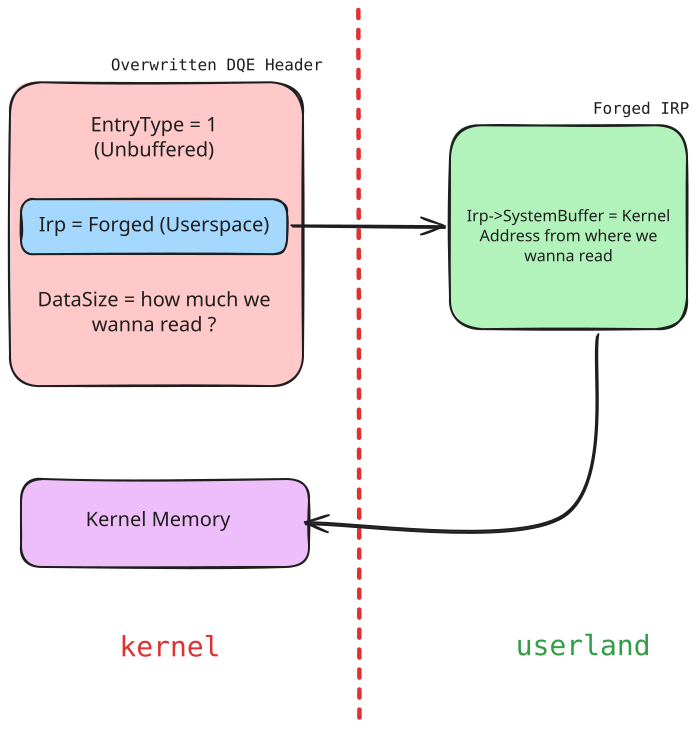
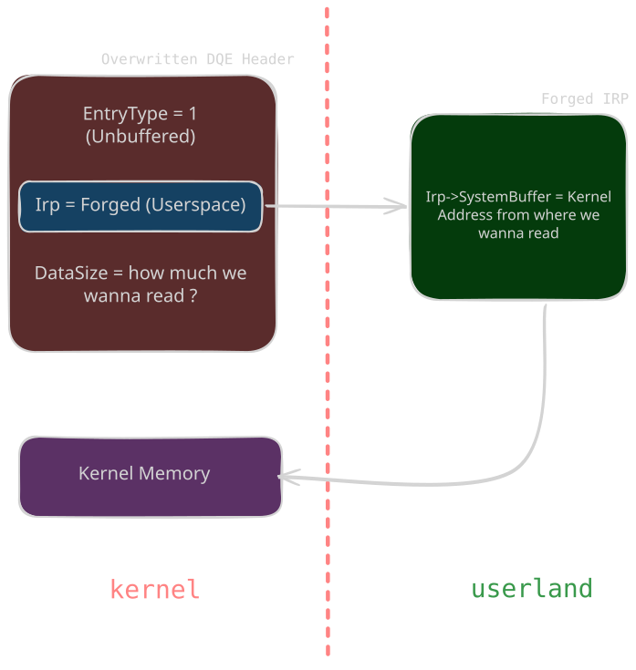
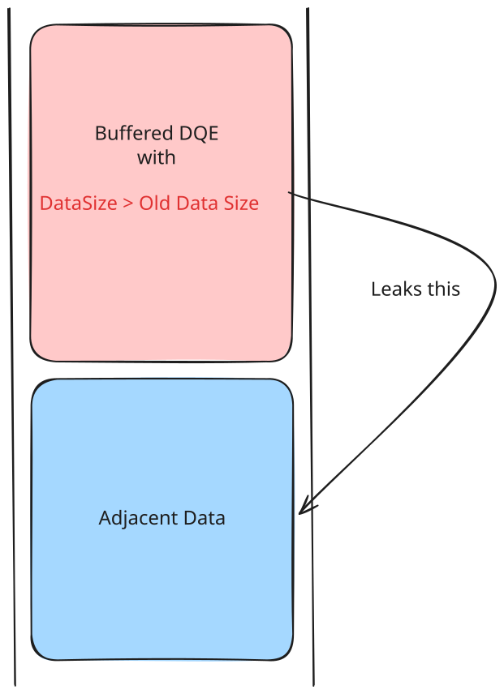
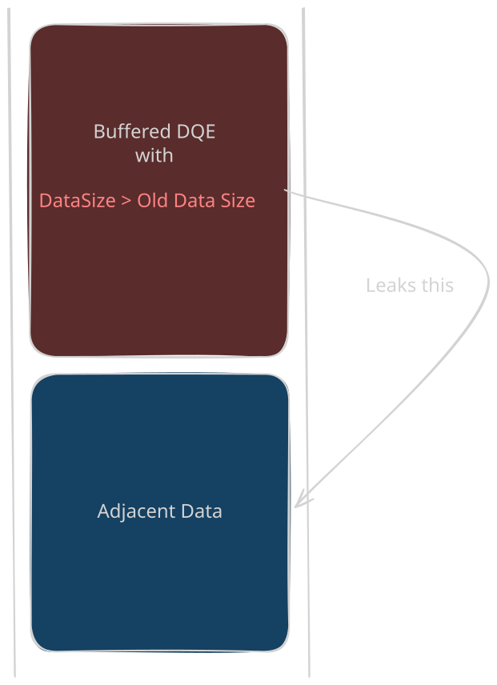
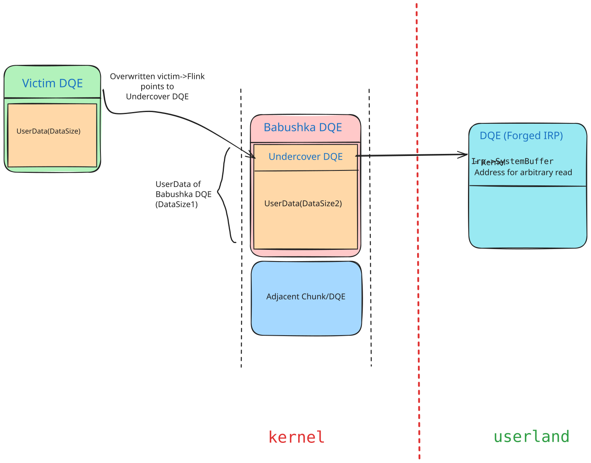
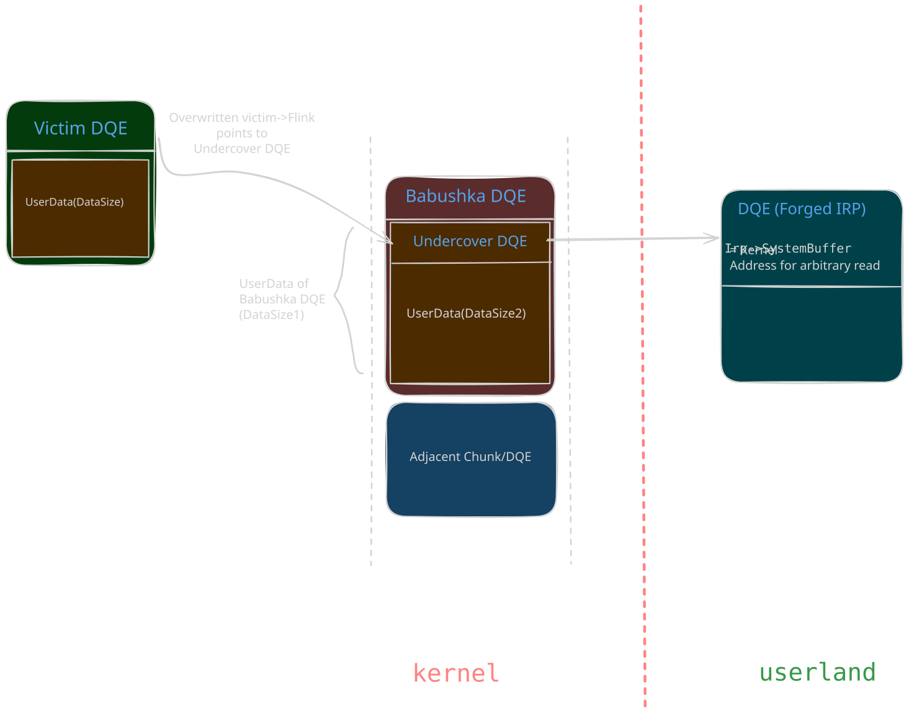
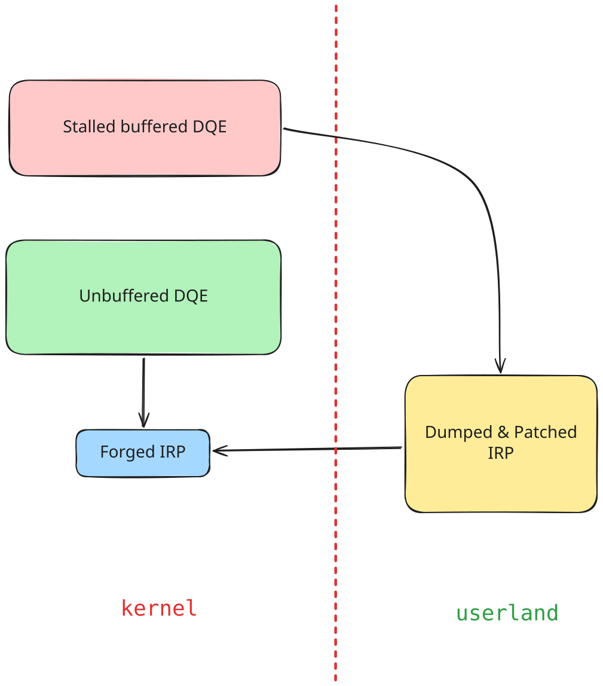
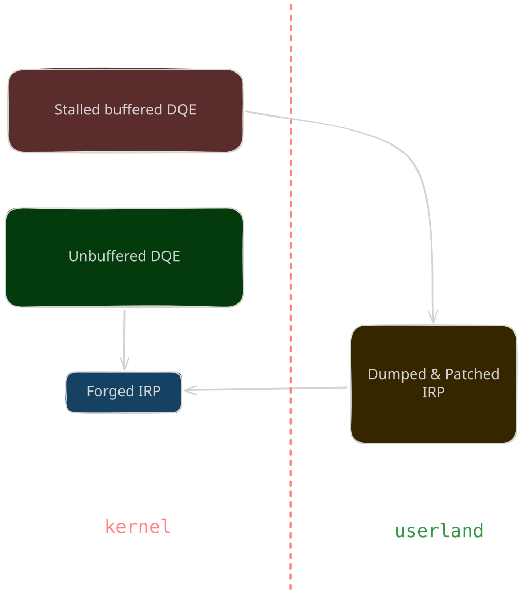

# Data Queue Entries (vp777)

<p class="reading-meta">{{ #word_count }} words · {{ #reading_time }}</p>

**Idea** : After spraying and grooming the pool we could use the overflow to rewrite the header of the `NP_DATA_QUEUE_ENTRY` sitting next to the vulnerable chunk, and the forged header turns that into arbitrary read and write. 

## 1. Arbitrary Read Using Unbuffered Entries

Works when the overflow lets you fully control the bytes written past the chunk and you already know the address you want to read.

<span class="theme-diagram" width="60%">
  
  
</span>

Forge an unbuffered entry whose `Irp` points at a forged IRP with `SystemBuffer` set to the kernel address to read from:

```c
DATA_QUEUE_ENTRY:
    NextEntry = whatever;
    Irp = Forged IRP Address;   // can be a userspace address if SMAP is absent
    SecurityContext = 0;
    EntryType = 1;              // unbuffered
    QuotaInEntry = 0;
    DataSize = arbitrary read size;

IRP->SystemBuffer = kernel address to read from;
```

Reading `DataSize` bytes from the pipe copies them from wherever `IRP->SystemBuffer` points. 

## 2. Arbitrary Read Using Buffered Entries

Before you know any address, there is nothing to point a forged IRP at. This variant makes use of the pool overflow to rewrite the DQE `DataSize` field of a buffered entry with a bigger value so that it reads past the entry's real data into whatever sits behind it.

<span class="theme-diagram" width="40%">
  
  
</span>

```c
DATA_QUEUE_ENTRY:
    NextEntry = whatever;
    Irp = 0;
    SecurityContext = 0;
    EntryType = 0;              // buffered
    QuotaInEntry = 0;
    DataSize = something bigger than the original size;
```

This technique can be used to leak pointers/heap metadata and other interesting data that could be found after our DATA_QUEUE_ENTRY.

## 3. Arbitrary Read with Limited Control (Flink Only)

Some overflows only let you write a few bytes, or the bytes are not yours to choose (a `memset` with fixed values, for example). Then the best you can do is overwrite the `Flink` of a victim entry and point it at data you control, an "undercover" DQE, and run the reads above through it.

<span class="theme-diagram diagram-lg" width="85%">
  
  
</span>

*In the diagram, "Babushka" refers to a Russian nesting doll ie. one object contains another object of the same kind.
So the core idea is be to create a babushka DQE such that its data contains another DQE("undercover" DQE here)*

- The victim entry's `Flink` now points to the undercover DQE, which is composed of user-controlled data.
- `DataSize1` = undercover header + `DataSize2`, and `DataSize2` = `DataSize1` - undercover header.
- `DataSize2` should be at least `DataSize1-sizeof(DATA_QUEUE_ENTRY)+n` to read n bytes from the adjacent memory/chunk.
- To read `n` bytes from chunk 2: read `DataSize + DataSize1 - sizeof(DATA_QUEUE_ENTRY) + n`.

<div class="admonition note">
<p class="admonition-title">PeekNamedPipe</p>
<p>Since Windows 7, <code>LIST_ENTRY</code> unlinking validates <code>entry-&gt;Flink-&gt;Blink == entry</code> (<em>safe-unlink</em>). Reading <code>DataSize</code> bytes causes the overflowed <code>DATA_QUEUE_ENTRY</code> to be unlinked, and the corrupted pointers trigger a bugcheck. <code>PeekNamedPipe</code> avoids this by walking the queue without unlinking entries, allowing the undercover <code>DATA_QUEUE_ENTRY</code> to be activated without triggering safe-unlink.</p>
</div>

The practical flow:

1. Groom the pool so the redirected `Flink` lands on the undercover DQE.
2. Overflow the victim's `Flink`.
3. Use `PeekNamedPipe` with a small size to activate the undercover DQE and leak adjacent pool memory (ASLR bypass).
4. Modify the contents of the specified userspace address to hold a forged `DATA_QUEUE_ENTRY` that facilitates the arbitrary read.
5. Use `PeekNamedPipe` with size = `DataSize + DataSize2 + n` to leak `n` bytes from the address set in the `SystemBuffer` of the IRP.

## 4. Arbitrary Write

At this point we can read kernel memory but not change it. Now we want to modify our own process token to elevate privileges from low integrity. The classic move is copying the SYSTEM process token over our own.

The write comes from the quota mechanism ie. when a buffered write exceeds the pipe quota in blocking mode, the entry waits in the queue as a stalled write with `QuotaInEntry < DataSize`, holding its IRP. Every read frees quota, `QuotaInEntry` climbs back up, and once it reaches `DataSize`, npfs completes the IRP through `IofCompleteRequest`. An entry forged to look like a stalled write therefore decides which IRP gets completed, and the IRP decides where the write lands: its `AssociatedIrp` holds the source address to copy from and its `UserBuffer` holds the destination to overwrite.

Say the pipe quota is `0x1000` bytes and it is already full. A `WriteFile` of `0x800` bytes cannot fit, so npfs queues it with `QuotaInEntry = 0` and parks the write IRP. Reading `0x200` bytes from the other end frees `0x200` of quota, and that credit goes to the stalled write, so `QuotaInEntry` becomes `0x200`. Once enough reads bring `QuotaInEntry` up to `0x800` (the write's `DataSize`), npfs decides there is finally room and completes the pending IRP. The write only "finishes" when the queue has room for it.

The forged entry abuses exactly this bookkeeping:

```c
DATA_QUEUE_ENTRY:
    NextEntry.Flink = accessible address;
    Irp             = forged IRP address;
    SecurityContext = 0;
    EntryType       = 0;              // buffered
    QuotaInEntry    = DataSize - 1;   // one byte of quota left
    DataSize        = write size;

Forged IRP:
    Flags          &= ~IRP_DEALLOCATE_BUFFER | IRP_BUFFERED_IO | IRP_INPUT_OPERATION;
                   // clears only IRP_DEALLOCATE_BUFFER; the input flags are kept/set here
    AssociatedIrp  = source address;
    UserBuffer     = destination address;
    ThreadListEntry.Flink = ThreadListEntry.Blink = &forged IRP's ThreadListEntry;
```

<span class="theme-diagram" width="70%">
  
  
</span>

The practical flow:

1. Spray the pool with DQEs.
2. Establish the arbitrary read using the above techniques.
3. Use the leaked pointers to identify a DQE adjacent to the undercover DQE (`leaked_entry->Flink->Blink` gives its address) and find the pipe handle that owns it.
4. Create a new buffered DQE entry holding an IRP on that handle by writing more than the pipe quota so the write stalls in the queue.
5. Use the arbitrary read to find the new entry's address (`leaked_entry->Flink`), then its IRP address, and dump the full IRP contents. We need to use the leaked IRP as otherwise, a fake one would fail `IofCompleteRequest`'s validation.
6. Forge the stalled write DQE entry around the patched IRP: `QuotaInEntry = DataSize - 1` and `DataSize = write size`. The one-byte quota gap is the trigger, since the queue now looks like a write waiting for exactly one byte of room. Host the IRP in an **unbuffered** entry, because `IofCompleteRequest` tends to free the buffer it points at.
7. Read a single byte from the pipe. `QuotaInEntry` climbs to `DataSize`, npfs decides the stalled write has room, and `IofCompleteRequest` completes the forged IRP. The kernel then copies from the address in `AssociatedIrp` to the address in `UserBuffer`, giving us arbitrary write :)

