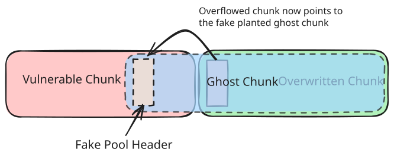
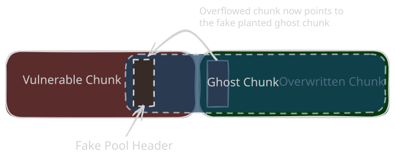

# Aligned Chunk Confusion (SSTIC)

<p class="reading-meta">{{ #word_count }} words · {{ #reading_time }}</p>

## The Vulnerability

The paper doesn't target one specific bug, it assumes a generic heap overflow into the kernel pool where the attacker can rewrite the 1st and 4th byte of the next chunk's `POOL_HEADER` with controlled values, that is the `PreviousSize` and `PoolType` fields. So a tiny 4 byte controlled overflow is enough here, since post 19H1 most of the other header fields went unused anyway. On top of that we also need to control the allocation and deallocation of the vulnerable object so we can spray and groom the pool reliably.

The exploitation idea with just these bytes is to abuse the `CacheAligned` free path and redirect where the kernel actually frees the overwritten chunk, giving us an arbitrary free. 

## Cache Aligned in PoolType (Arbitrary Free Primitive)

Some allocations are requested with the `CacheAligned` bit set in their `PoolType`. For those, the allocator pads the chunk and drops a **second** `POOL_HEADER` (the "aligned header") right before the address that gets returned to the caller, and it stores the distance back to the real chunk start in this second header's `PreviousSize` field (in `0x10` byte units, like every pool size field). So on free, the allocator needs to walk back to find where the actual chunk begins :

For more on how cache aligned allocations lay out the two headers, check the [CacheAligned section](05-pool-header.md#cachealigned) in the Pool Header chapter.

```c
if (AlignedHeader->PoolType & 4) {   // CacheAligned bit set?
    OriginalHeader = (QWORD *)AlignedHeader - AlignedHeader->PreviousSize * 0x10;
}
```

`AlignedHeader` is that second header sitting inside the alignment padding, `OriginalHeader` is which is used for free. The allocator does a
simple substraction to compute the original chunk address and then later free it.

The `if (AlignedHeader->PoolType & 4)` branch check is still there, but some checks were removed in 19H1 and afterwards, so the walk back is basically blind now : whatever `PreviousSize` says, the kernel frees that address without validating the destination. This is why the overflow needs to touch exactly those two header bytes : we set the `CacheAligned` bit ourselves to enter this branch (a normal chunk with the bit unset just takes the regular free path), and we control `PreviousSize` to decide where it lands. Point it at planted data in the middle of the previous chunk and the allocator frees a fake chunk that never existed, or point it back by the exact size of the previous chunk and you get a Use-After-Free instead.

## Quota Pointer Process Overwrite (Arbitrary Decrement Primitive)

An allocation can charge its quota against the requesting process. When that happens, the kernel stores a pointer to the `_KPROCESS` in the **`ProcessBilled`** field of the `POOL_HEADER` (see [Pool Header Structure](05-pool-header.md#pool-header-structure)), and on free it follows that pointer to decrement the process's quota charge. An overflow that controls `ProcessBilled` used to give an arbitrary dereference here (the classic Quota Process Pointer Overwrite), which is exactly why the pointer is now encoded :

```
ProcessBilled = KPROCESS_ptr ^ ExpPoolQuotaCookie ^ chunk_addr
```

On free the kernel decodes it and validates the result (kernel-mode address, valid process header type), then decrements the quota counter in the decoded "process". The **`ExpPoolQuotaCookie`** is generated at boot, so a blind overwrite decodes to garbage and bugchecks.

But the validation only checks that the decoded pointer *looks* like a process object. If we can leak the `ExpPoolQuotaCookie` and know the address of our chunk, both of which an arbitrary read gives us, we can encode a pointer that decodes to any address we choose. Pointing it at a fake `_EPROCESS` (sprayed with the right header type) makes the checks pass, and the free then decrements a counter at an attacker-chosen address : an **arbitrary decrementation primitive**. The decrement amount is the quota charge, derived from the chunk's size, so we control both where it lands and by how much.

## Exploitation

The paper's exploit chains the arbitrary free into a **ghost chunk**, a fake chunk carved inside a still-allocated one that spans the vulnerable and overwritten chunks. From there the arbitrary read and write primitives are built.

<span class="theme-diagram" width="70%">
  
  
</span>

1. Groom the pool so a controllable object sits right after the **vulnerable chunk**, then overflow its header with the **`CacheAligned`** bit set and **`PreviousSize`** pointing into the vulnerable chunk. The free computes `OriginalHeader = AlignedHeader - PreviousSize * 0x10`, so `PreviousSize = 0x15` walks back `0x150` bytes from the overwritten chunk's header. For a `0x180` sized vulnerable chunk that is exactly offset `0x30` inside it, which is where we plant the fake header in the next step.
2. Free the vulnerable chunk and reallocate it with a [`PipeAttribute`](09-exploitation-techniques.md#pipe-attributes) whose data plants our **fake `POOL_HEADER`** at offset `0x30`, with **`BlockSize = 0x21`**. The replanting is needed because the original object's data at that offset wasn't ours, the reallocation gives us byte-exact control of the memory the redirected free will hit. The `BlockSize` is not random : it's the size of the chunk that will actually be freed, and we want it easy to reuse. All sizes under `0x200` land in the LFH, so they are out. The smallest non-LFH allocation is `0x200`, a chunk of `0x210`. `0x210` uses the VS backend and is eligible for the **Dynamic Lookaside**, and its bucket can be enabled beforehand by spraying and freeing chunks of `0x210` bytes.
3. Free the overwritten chunk. This triggers the **cache aligned free** : the kernel frees `OverwrittenChunkAddress - (0x15 * 0x10)`, which is `VulnerableChunkAddress + 0x30`, exactly where our fake `POOL_HEADER` sits. So the header used for this free is ours, and instead of the overwritten chunk the kernel frees a `0x210` chunk straight onto the **Dynamic Lookaside**. The overwritten chunk is now in a **"lost" state** as the  kernel thinks it's freed.

The `PipeAttribute` objects used in the next steps are created through `NtFsControlFile` with the `0x11003C` control code, and their value is read back with `0x110038` :

```c
HANDLE read_pipe;
HANDLE write_pipe;
char attribute[] = "attribute_name\00attribute_value";
char output[0x100];
NTSTATUS status;

CreatePipe(&read_pipe, &write_pipe, NULL, 0);
NtFsControlFile(write_pipe, NULL, NULL, NULL, &status,
                0x11003C, attribute, sizeof(attribute), output, sizeof(output));

// read the attribute's value back, the kernel copies
// AttributeValueSize bytes from AttributeValue to output
char name[] = "attribute_name";
NtFsControlFile(read_pipe, NULL, NULL, NULL, &status,
                0x110038, name, sizeof(name), output, sizeof(output));
```

Per the paper, the size of the allocation and the data are fully attacker controlled, and the `AttributeName` and `AttributeValue` pointers point at different offsets of this data field.

4. **Leaking the content of the ghost chunk** : the ghost chunk can now be reallocated with a `PipeAttribute` object. The ghost's `PipeAttribute` structure lands right where the attribute placed in the vulnerable chunk reads its value from, since its `AttributeValue` was aimed into the ghost region on purpose. By reading the value of this pipe attribute, the data returned is the content of the ghost chunk's `PipeAttribute`, so its contents are leaked : the address of the ghost chunk, and thus of the vulnerable chunk, is now known. 
5. To get the full **arbitrary read** : free the vulnerable chunk one more time and reallocate it with another `PipeAttribute`, this time aiming its data on top of the ghost chunk's own `PipeAttribute` header. That header is what npfs follows when reading the ghost's attribute, so rewriting it puts the ghost's attribute structure under our control too. A **new `PipeAttribute` is injected in the attribute linked list, and it is located in userland** : the forged list pointers make the kernel follow the chain into our memory. Requesting the read of the ghost's attribute now makes the kernel use the userland `PipeAttribute`, and controlling its `AttributeValue` / `AttributeValueSize` is the **arbitrary read primitive**.

6. Overwrite the ghost header once more with the **`PoolQuota`** bit and a forged **`ProcessBilled`** pointing at a fake `_EPROCESS` sprayed with a Pipe Data Queue Entry. Freeing the **ghost chunk** now decrements an attacker-chosen counter.
   This means the Quota Pointer Process Overwrite attack can be used to get an arbitrary decrementation primitive. The `ExpPoolQuotaCookie` and the address of the ghost chunk can be recovered using the arbitrary read primitive.

7. The first decrement lands on **`TOKEN->Privileges.Enabled`**, and a second pass on **`Privileges.Present`** (this one is checked since 1607). With **`SeDebugPrivilege`** set in both, our process can now open a SYSTEM process and inject into it.

<div class="admonition note">
<p class="admonition-title">Writeup Coming Soon</p>
<p>Example writeup of this technique is coming soon.</p>
</div>
